## 索引

- [2023](#2023)
- [2022](#2022)
- [2021](#2021)
- [2020](#2020)
- [2019](#2019)
- [2018](#2018)
- [2017](#2017)
- [2016](#2016)

## 2024

### 文学

#### 1.[《愿你顺风顺水，自成山海》](https://book.douban.com/subject/36967143/) - 2024.08.11

	
RATE: ★★★☆☆
第一次收到赠书，但无疑就是快餐销量书。和短视频一样有着它自己的受众。

 
 
 
 
 
 
 

#### 2.[《叫我自己親愛的》](https://book.douban.com/subject/26841081/) - 2024.11.28 [@[美]瑞蒙·卡佛](https://book.douban.com/search/%E7%91%9E%E8%92%99%C2%B7%E5%8D%A1%E4%BD%9B)

	
RATE: ★★★☆☆
这本书收录了卡佛的各类杂文选集，内容一贯是卡佛的风格。不管是散文、书评或是引言杂谈，“卡佛式”的风格贯穿始终。本书大概读了两遍，繁体配合竖排的文本，读起来慢吞吞，没有读出什么名堂来，读完也没有什么特别的话想说，值得摘录的句子倒是多多少少记下了一些。令我意外的是这一本台湾出版的书，我是在香港书店买到的，而且进行了重新定价。但不论是香港的书价还是台湾的书价，都比内地的价格高许多。

 
 
 
 
 

##### 部分摘录

> 《父亲的一生》 章节 37 页
> 我想要一个切合我当时有感而写的心境的月份——一个白昼渐短、光线暗淡、烟气弥漫、了无生气的月份。六月是白昼黑夜都是夏天的月份，是学校毕业的月份，是我过结婚纪念日、我的其中一个孩子过生日的月份。六月不该是人父死亡的月份。
>
> 《谈写作》 章节 42 页
> 写作人不需要花招或噱头，甚至不必是团队中最聪明的家伙。有时候，一个作家必须能够心无二用的观察一些有的没的，无论是一轮落日或是一只旧鞋，都能带着绝对纯粹的惊奇——即使让自己看来像个傻瓜。
>
> 《火》章节 48 页
> 影响是一种力道——就像环境、个性，又如同潮水之不可逆。我没办法说哪些书或哪些作家对我又影响力。这种影响，文学的影响，我很难明确的说清楚。就好像要我说自己是受到所有读过看过的书的影响，或是说我没有受到任何一位作家的影响，都同样的不恰当。
>
>《火》章节 55 页
>在那一刻，这世上没有任何事物——老兄啊，没有任何一样事物——感觉比这件事更迫近、更重要、更能改变我的人生——那就是，我永远都会有这两个孩子在，我会处在这样一个责任摆脱不掉，不断遭受干扰的位置上，永永远远。 我现在说的是真正的“影响力“。我在说月亮和潮汐。它就是这样冲着我而来。就像窗户被吹开时的那一阵疾风。在到达我生命中的那个关键节点之前，我一直在想，到底想什么，我也说不上来，只是觉得事情终究会有办法解决——我所希望的或是想要做的事情终究会有心想事成的一天。但在那一刻，在自助洗衣店里的那一刻，我发现，那是不可能的。
>
>《約翰．加德納：作家老師》章节 73 页
>我们讨论稿子里所有的逗号，好像在那一刻全世界只有这件事才是大事——事实上，也的确如此。
>
> 《約翰．加德納：作家老師》章节 75 页
> 没有哪一个老师或是哪一种教育，能够把一个原本不能成为作家的人造就成一位大作家。不过不管从事什么行业，追求什么目标，都会有挫折失败的风险。
>
> 《友谊》章节 77 页
> 我们是朋友。而朋友，就是在相聚的时候尽情欢乐。
> 这方面我们互相都很了解，其他方面也是。我们会是朋友，部分原因就在于我们充分了解这一点。我们彼此互相关爱对方，但我们对自己的关爱更多一些。
>
> 《關於〈我在這裡打電話 〉》章节 133 页
> 第一次读到这句话，我就获得极大的启示。这就是我对自己写的小说所要求的：用对的字，用对的意象，还有，用对的、正确的标点符号，唯有如此，读者才会全心投入故事——除非房子着火，否则绝不移开视线。要求文字承担行动的力量，这或许是奢望，确实一个年轻作家的愿望。我仍然坚持这一信念：明确强劲的作品才能抓住读者。这依旧是我今天努力的主要目标之一。
>
> 《所有跟我相關的》章节 158 页
> 我希望大家看这些作品是为了愉快和休闲，为了慰藉和鼓励——为了任何一个令你倾心文学的理由——并且认知到这些作品并非只为了让我们看到我们眼下的生活（比这个目标更糟的事，作家都能做得到），更有一些别的东西，也许事一种串联的感觉，一种毋庸置疑的美感：世上没有别的东西能够比短篇小说所表现的美感更能让人看见。我希望读者随时随地都能从中找到令他们感兴趣，甚至感动的东西。因为假如写短篇小说和读短篇小说互不相干，那么我们这么起劲事为了什么呢？请告诉我，我们究竟在干什么？我们又何必聚在这儿呢？
>
> 《有前因和後果的小說（與湯姆簡克斯合編）》章节 166 页
> 我们想说，才华或天赋，也可以是一种“看到别人已看到的东西，只是看得更清晰、更全面的能力”。而艺术，便是存在于这两者之中。
>
> 《巴塞爾姆的無人性喜劇》章节 187 页
> 模仿者学到巴尔赛姆的皮毛，学会了那些简单容易又明显的东西，却没有他卓越的才华，没有他那种令人惊艳的，原创式的表达爱与失落、胜利与绝望的天赋。于是满目疮痍，遍地都是失望和心碎，真是天晓得，如果一个作家专门写这类东西，整篇都是一些无病呻吟，自怨自艾的人物在吞噬来路不明的焦虑、苦恼和哀怨——这，当然是不行的。
>
> 《一位風華正盛的天才小說家》章节 204 页
> 因为我只能就这个故事的主线点到为止，没办法详尽的告诉你其中“究竟发生什么”；我要说的事，这本小说里讲的绝对是一些至关紧要的事物：勇气、忠诚、爱、友谊、危险、自信，和一个男人终其一生寻找真我的旅程。
>
> 《點亮黑暗的小說》章节 208 页
> 最好的长篇和短篇小说里面，善是一种信仰。忠诚、爱、坚毅、勇气、正直这些东西不见得都能得到回报，但它们就是公认的美好，高贵的情操。而邪恶、卑劣，或者单纯一个愚蠢的行为，给人的感受就是：邪恶、卑劣、愚蠢。生活中必然有一些绝对，一些真理，只要有心，我们就一定不会忘记它们。
>
> 《點亮黑暗的小說》章节 210 页
> 他怀疑家根本就不是一个地方，而是一段时间，它要走了，就永远的走了。
>
> 《一名退休雜耍演員倒在少女的魔力之下》章节 224 页
> 这本书没有第一本里的那种强悍的冲劲，和令人为止屏息的场面，这是一本好书，但不是一本伟大的或是令人特别难忘的书。我并无贬损的意思。很多好的小说都是这样——“好”，但不伟大，也不是总令人难忘。
>
> 《成年，崩潰》章节 250 页
> 读完这本书，对于海明威的观感只有一种解药可以救，就是立刻回去重新再读他写的小说。杰出的作品依旧是那么的清澈、明朗、纯粹：仿佛有一种贴身的交流，当你的手指在翻动书页的时候，当你的眼睛在接收哪些文字的时候，你的脑子自然的开始想象，开始体会文句中的意象，就如海明威说的，“就好像是自己的亲身经历一般。”海明威做到了，他永远都在做。

### 技术

#### 1.[《网络是怎样连接的》](https://book.douban.com/subject/26941639/) - 2024.02.29  [[日] 户根勤](https://book.douban.com/search/%E6%88%B7%E6%A0%B9%E5%8B%A4)

	
RATE: ★★★✰☆
整理了一份时序图如下。

 
 
 
 

```mermaid
sequenceDiagram
  box 网络包的旅程
  actor 浏览器
  actor Web服务器
  end

  %% 用户输入网址
  浏览器->>Web服务器: HTTP消息
  par 客户端
  rect rgb(191, 223, 255)
  critical
  option 浏览器
  %% 浏览器解析网址，生成 HTTP消息然后转交给Socket库
  option Socket
  %% Socket 库把收到的 HTTP 消息作为数据转交给协议栈
  note right of 浏览器: HTTP 消息
  end
  critical 协议栈
	 option TCP
	 %% TCP 按照网络包的长度对数据进行拆分，在每个包前面加上 TCP 头部然后转交给 IP
	 note right of 浏览器: TCP/HTTP 数据块、TCP/HTTP 数据块
	 option IP
	 %% IP 在 TCP 包前面加上 IP 头部，然后查询 MAC 地址并加上 MAC 头部，然后把包交给网卡驱动
	 note right of 浏览器: MAC/IP/TCP/HTTP 消息
	 浏览器->>Web服务器: 接收方 MAC 地址是最近的路由器 MAC 地址
	 浏览器->>Web服务器: 接收方 IP 地址是 Web 服务器的 IP 地址
    end

  critical 物理层
	 option 网卡驱动
	 %% 网卡驱动收到 IP 发来的数据包，转交给网卡并且发出指令
	 浏览器->>Web服务器: 接收方 MAC 地址是最近的路由器 MAC 地址
	 浏览器->>Web服务器: 接收方 IP 地址是 Web 服务器的 IP 地址
	 note right of 浏览器: MAC/IP/TCP/HTTP 消息
	 option 网卡
	 %% 网卡检查以太网的可发送状态，把包转成电信号通过双绞线发送出去
	 note right of 浏览器: 电信号
    end
  end
  and 客户端局域网
	  critical
		 option 双绞线
		 %% 信号通过双绞线到达集线器
		 note over 浏览器,Web服务器: 电信号
		 option 集线器
		 %% 集线器把信号广播到所有端口，信号到达交换机
		 note over 浏览器,Web服务器: 电信号
		 option 交换机
		 %% 交换机根据收到的包的接收方 MAC 地址查询自身的地址表找到输出端口，然后把包转发到输出端口
		 浏览器->>Web服务器: 接收方 MAC 地址是最近的路由器的 MAC 地址
		 浏览器->>Web服务器: 接收方 IP 地址是 Web 服务器的 IP 地址
		 note over 浏览器,Web服务器: MAC/IP/TCP/HTTP 数据块
		 option 互联网接入路由器
		 note over 浏览器,Web服务器: IP/TCP/HTTP数据块
		 %% 互联网接入路由器根据收到的包的接收方 IP 地址查询自身的路由表找到输出端口，然后把包转发到输出端口
		 浏览器->>Web服务器: 接收方 IP 地址是 Web 服务器的 IP 地址
		 note over 浏览器,Web服务器: MAC/PPPoE/PPP/IP/TCP/HTTP消息
		 option ADSL Modem
		 %% 互联网接入路由器输出到互联网的包带有 PPPoE 头部和 PPP 头部
		 浏览器->>Web服务器: 接收方 MAC 地址是 BAS 的 MAC 地址
		 浏览器->>Web服务器: 接收方 IP 地址是 Web 服务器的 IP 地址
		 %% ADSL Modem 把收到的包拆分成 ATM 信元
		 note over 浏览器,Web服务器: ATM 信元
		 %% ADSL Modem 把拆分后的 ATM 信元转成电信号通过电话线发送出去
	    end
  and 接入网
	  critical 接入网
	    %% ADSL Modem 发送的信号通过电线杆上的电话线到达电话局的 DSLAM
		 note over Web服务器: 电信号
		 option DSLAM(局端多路 Modem）
		 %% DSLAM 把收到的电信号还原成 ATM 信元再发送给 BAS
		 note over Web服务器: ATM 信元
		 option BAS(宽带接入服务器)
		 %% BAS 把 ATM 信元还原成网络包，根据接收方 IP 地址进行转发
		 note over Web服务器: MAC/PPPoE/PPP/IP/TCP/HTTP 数据块
		 option 隧道
		 %% BAS 转发的包加上 L2TP 头部再通过隧道
		 note over Web服务器: L2TP/PPP/IP/TCP/HTTP 数据块
		 option 隧道专用路由器
		 %% 网络包到达隧道出口的隧道路由器，L2TP 头部和 PPP 头部被丢弃，通过互联网流向 Web 服务器
		 note over Web服务器: IP/TCP/HTTP数据块
	    end
  and 互联网
	  loop 互联网运营商
		 %% 服务器端的局域网中有防火墙，对进入的包进行检查，判断是否允许通过
		 note over Web服务器: MAC/IP/TCP/HTTP 数据块
		 end
	  浏览器->>Web服务器: 接收方 MAC 地址是缓存服务器或者 Web 服务器的 MAC 地址
	  浏览器->>Web服务器: 接收方 IP 地址是Web 服务器的 IP 地址
  and Web服务器端局域网
	  rect rgb(191, 223, 255)
	  critical Web服务器端局域网
		 note over Web服务器: MAC/IP/TCP/HTTP 数据块
		 option 防火墙
		 %% Web 服务器前面如有有缓存服务器，会拦截通过防火墙的包；如果用户请求的页面已经缓存在服务器上，就代替服务器向用户返回页面数据
		 浏览器->>Web服务器: 接收方 MAC 地址是缓存服务器或者 Web 服务器的 MAC 地址
	    浏览器->>Web服务器: 接收方 IP 地址是Web 服务器的 IP 地址
		 note over Web服务器: MAC/IP/TCP/HTTP 数据块
		 option 缓存服务器
		 %% 如果请求的页面没有被缓存，缓存服务器会把请求转发给 Web 服务器
		 浏览器->>Web服务器: 接收方 MAC 地址是 Web 服务器的 MAC 地址
	    浏览器->>Web服务器: 接收方 IP 地址是 Web 服务器的 IP 地址
	    end
	  end
  and Web服务端
	  rect rgb(191, 223, 255)
	  critical 物理层
		 option 网卡
		 option 网卡驱动
		 %% Web服务器收到包后，网卡和网卡驱动会接收这个包然后转交给协议栈
		 note right of Web服务器: MAC/IP/TCP/HTTP 数据块
	  end
	  critical 协议栈
		  option IP
		  %% 协议栈依次检查 IP 头部和 TCP 头部，如果没有问题就取出 HTTP 消息的数据块进行组装
		  note right of Web服务器: TCP/HTTP 数据块、TCP/HTTP 数据块
		  option TCP
		  note right of Web服务器: HTTP消息
	  end
	  critical Web服务器端
		 %% HTTP 消息恢复成原始形态，然后通过 Socket 转交给 Web 服务器
		 option Socket
		 %% Web 服务器分析 HTTP 消息的内容，然后根据请求内容把读取的数据返回给客户端
		 note right of Web服务器: HTTP消息
	  end
	  end
  end
  Web服务器->>浏览器: HTTP消息
```

> [详见](https://github.com/kyriejoshua/network-protocol-notes/blob/main/lib/%E5%BC%95%E5%AD%90/index.md#%E7%BD%91%E7%BB%9C%E6%98%AF%E6%80%8E%E6%A0%B7%E8%BF%9E%E6%8E%A5%E7%9A%84%E6%97%B6%E5%BA%8F%E5%9B%BE)

#### 2. 《代码整洁之道》TODO

#### 3.[《Javascript 高级程序设计》(第4版)](https://book.douban.com/subject/35175321/) - 2020.11.29 阅读中

核心章节已阅读 2021.07

 
 
 
 
 
 
 

- [x]  章节 9 Proxy 已阅读。[记录](https://github.com/kyriejoshua/javascript-study/blob/master/lib/Professional-JavascriptV4/part9.js) - 2022.08

### [2023](2023/index.md)
### [2022](2022/index.md)
### [2021](2021.md)
### [2020](2020.md)
### [2019](2019.md)
### [2018](2018.md)
### [2017](2017.md)
### [2016](2016.md)
### [STAR](star.md)

- [2022](#2022)
- [2021](#2021)
- [2020](#2020)
- [2019](#2019)
- [2018](#2018)
- [2017](#2017)
- [2016](#2016)
