## 一、CPU 是什么

### 1. CPU 的内部结构

#### 1.1 寄存器、控制器、运算器、时钟

##### 1.1.1 寄存器

寄存器负责暂存指令、数据等处理对象，是内存的一种。
##### 1.1.2 控制器

控制器负责把内存上的指令、数据等读入寄存器，并根据指令的执行结果来控制计算器。

##### 1.1.3 运算器

运算器负责运算从内存读入寄存器的数据。

##### 1.1.4 时钟

时钟负责发出 CPU 开始计时的时钟信号。
* 时钟信号的频率越高，CPU 运行速度越快。单位是 ***GHz***.

### 2. CPU 是寄存器的集合体

#### 2.1 CPU 寄存器

CPU 寄存器内有多个寄存器，不同的寄存器的数量、种类和存储的数值范围都是不同的。

常见的寄存器：
* 基址寄存器
* 变址寄存器
* 程序计数器
* 指令寄存器
* 通用寄存器
* 累加寄存器
* 标志位寄存器
* 栈寄存器

### 3. 程序计数器

程序计数器决定着程序的流程。
### 4. 条件分支和循环

#### 4.1 顺序执行

顺序执行是按照地址内容的顺序执行指令。

#### 4.2 循环指令

循环是指重复执行同一地址的指令。

#### 4.3 条件分支

条件分支是指根据条件执行任意地址的指令。
#### 4.4 标志位寄存器

条件分支和循环中，使用跳转指令来实现。借助标志位寄存器的结果，来判断是否要进行下一步操作，例如下一条件或终止循环。
* 程序中的比较指令，实际上就是在 CPU 内部做减法运算，用结果再和 0 比较。

### 5. 函数调用

核心是使用 `call` 指令和 `return` 指令来实现。

* call 指令进行函数调用，把函数内要执行的指令存储在栈中。函数调用的地址存储在程序计数器里。
* return 把保存在栈中的地址(理解为函数的结果)，设定到程序计数器中。
### 6. 地址和索引实现数值

使用变址寄存器和基址寄存器，实现数组。

#### 6.1 基址寄存器

**基址寄存器，决定数组的起始位置。**
* x86 架构里，使用 `ebx` `ebp` 作为基址寄存器。
#### 6.2 变址寄存器

**变址寄存器存储每个数据的相对位置索引。**
* 单单使用基址寄存器，无法直接得到位置索引，需要先进行一轮计算。

假设我们有一个 `int` 数组（每个元素 4 字节），首地址存放在 `EBX` 中。如果想访问下标为 `i` 的元素，如果不使用变址寄存器，代码会像这样：

```assembly
; 假设 i 存放在 ECX 中
mov eax, ecx        ; 将索引 i 复制到 eax
shl eax, 2          ; 乘以 4 (左移2位相当于乘以4)
add eax, ebx        ; 加上基址，得到元素地址
mov edx, [eax]      ; 从该地址读取数据到 edx
```

使用变址寄存器，是这样

```assembly
mov edx, [ebx + ecx*4]   ; 直接读取 arr[ecx]
```

### 7. CPU 的指令

CPU 的机器指令主要类型分为以下几种。

#### 7.1 数据转送指令

寄存器和内存、内存和内存、寄存器和外围设备之间的数据读写操作。

#### 7.2 运算指令

用累加寄存器执行算数运算、逻辑运算、比较运算和移位运算。

#### 7.3 跳转指令

实现条件分支、循环、强制跳转等。

#### 7.4 call/return

函数的调用和返回函数调用的地址。

## 二、二进制的数据

### 1. 使用二进制的原因

计算器内部的电子部件是 IC。IC 有无数个引脚，但每个引脚，只能表示 2 种状态。
计算机处理的信息的基本单位是 8 位二进制数。
* 8 位二进制数，是基本的信息计量单位，称为**字节**。
* **位**是最小的单位。

### 2. 什么是二进制

二进制的**基数**是 2.
二进制的**位权**，依次是 1,2,4,8。2 的次方。
* 位权是用来和各数字位的数字相乘的数值。
* `10110001`

### 3. 移位运算

移位运算指的是将二进制的数值的各数位进行左右移位的运算。
* 移位运算可以显著减少 CPU 消耗，因为这里不涉及加减法，无需消耗寄存器。
#### 3.1 举例

向右移两位，相当于十进制中除以 100.二进制则是除以 4.下面是 js 的结果

```javascript
const a = 8;
console.log(a >> 2); // 右移 2 位得到 2
console.log(a << 2); // 左移 2 位得到 32
```

#### 3.2 向左移位

左移时，直接在低位补零即可。
右移才会区分逻辑右移和算术右移，下文会提到。

### 4. 计算机处理的“补数” ⭐️

在计算机中实现减法运算时，实际上是在做加法运算。

**补数就是用正数来表示负数。**

补数的求解变换就是取反➕1.

### 5. 逻辑右移和算术右移

#### 5.1 逻辑右移

像图像一样，霓虹灯移动效果，此时的二进制是图形模式。移位后需要在最高位补 0.

#### 5.2 算术右移

把二进制作为带符号的数值进行运算，移位后，要在最高位填充**移位前**的**符号位的值**（0 或者 1）.

符号扩充就是指在保持值不变的前提下，将其转成 16 位和 32 位的二进制数。

### 6. 如何进行逻辑运算

#### 6.1 逻辑非

##### 6.1.1 NOT 真值表

| A 的值 | NOT A 的运算结果 |
| ---- | ----------- |
| 1    | 0           |
| 0    | 1           |

#### 6.2 逻辑或

只要 2 个值中有一个值为 1，结果就为 1.
只有 2 个值都为 0，结果才为 0.
##### 6.2.1 OR 真值表

| A 的值 | B 的值 | A OR B 的运算结果 |
| ---- | ---- | ------------ |
| 1    | 1    | 1            |
| 0    | 1    | 1            |
| 1    | 0    | 1            |
| 0    | 0    | 0            |

#### 6.3 逻辑与

只要 2 个值中有一个值为 0，结果就为 0.
只有 2 个值都为 1，结果才为 1.
##### 6.3.1 AND 真值表

| A 的值 | B 的值 | A AND B 的运算结果 |
| ---- | ---- | ------------- |
| 1    | 1    | 1             |
| 0    | 1    | 0             |
| 1    | 0    | 0             |
| 0    | 0    | 0             |

#### 6.4 逻辑异或

只要 2 个值相同，结果就为 0。
只要 2 个值不同，结果就为 1.
##### 6.4.1 XOR 真值表

| A 的值 | B 的值 | A XOR B 的运算结果 |
| ---- | ---- | ------------- |
| 1    | 1    | 0             |
| 0    | 1    | 1             |
| 1    | 0    | 1             |
| 0    | 0    | 0             |

## 三、计算机进行小数运算

### 1. 使用二进制表示小数 ⭐️

使用各个数位的数值和位权相乘的结果相加。

#### 1.1 计算 1011.0011

从整数位的高位，依次向右相加，直到小数点后的数位，得到下面的计算公式

1 `*` $2^{3}$  `+` 0 `*` $2^{2}$   `+` 1 `*` $2^{1}$  `+` 1 `*` $2^{0}$  `+` 0 `*` $2^{-1}$  `+` 0 `*` $2^{-2}$  `+` 1 `*` $2^{-3}$  `+` 1 `*` $2^{-4}$ 

等于

```shell
1 * 8 + 0 * 4 + 1 * 2 + 1 * 1 + 0 * 0.5 + 0 * 0.25 + 1 * 0.125 + 1 * 0.0625

8 + 0 + 2 + 1 = 11 // 整数位
0 + 0 + 0.125 + 0.0625 = 0.1875 // 小数位
```

得到结果 **`1011.0011 =  11.1875`**

### 2. 二进制无法表示所有小数

连续的二进制数，通过各种组合，也无法完全覆盖所有的十进制数。
二进制数的数值，以小数点后 4 位为例。只能表示有限的十进制数。

#### 2.1 小数点 4 位表示的数值

| 二进制数   | 十进制数   |
| ------ | ------ |
| 0.0001 | 0.0625 |
| 0.0010 | 0.125  |
| 0.0011 | 0.1875 |
| 0.0100 | 0.25   |
| 0.0101 | 0.3125 |
| 0.0111 | 0.4375 |
| 0.1000 | 0.5    |
| 0.1001 | 0.5625 |
| 0.1010 | 0.625  |
| 0.1011 | 0.6875 |
| 0.1100 | 0.75   |
| 0.1101 | 0.8125 |
| 0.1110 | 0.875  |
| 0.1111 | 0.9375 |

可以看到，这中间少了很多十进制的数值。

### 3. 浮点数

浮点数是指用**符号**、**尾数**、**基数**和**指数**这四部分来表示的小数。

多数编程语言都提供了两种表示小数的数据类型，双精度浮点数和单精度浮点数。
* 双精度浮点数类型使用 64 位；
* 单精度浮点数使用 32 位。

C 语言，双精度浮点数类型是 `double`,单精度浮点数类型是 `float`.

#### 3.1 IEEE 标准表示小数

$$±m\times n^{a} $$

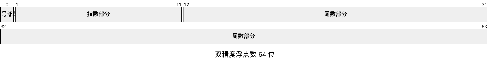
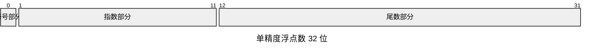

符号部分使用一个数据位来表示数值的符号。
* 数据位 1 表示负，为 0 时表示“正或者 0”。

尾数部分用的是小数点前面的值固定为 1 的正则表达式。

指数部分用的则是“EXCESS”系统表现。

##### 3.1.1 尾数部分

尾数部分是正则表达式，它可以把表现形式多样的浮点数，统一为一种表现形式。

浮点数可以用不同形式来表现同一个数值。

$$ 0.75 = 0.75 \times 10^{0}$$
$$ 0.75 = 75 \times 10^{-2}$$
$$ 0.75 = 0.075 \times 10^{1}$$

单精度浮点数的尾数部分的表达式

```javascript
1011.0011 // 原始数值
0001.0110011 // 右移使得整数部分的第 1 位变成 1
0001.01100110000000000000000 // 确保小数点以后的长度是 23 位
01100110000000000000000 // 只保留小数点后的部分，完成正则表达式
```

##### 3.1.2 指数部分 (EXCESS)

EXCESS 系统表现是，通过把指数部分表示范围的中间值设为 0，从而让负数不需要符号来表示。
* 指数部分是 8 位单精度浮点小数时，最大值 `11111111 = 255` 的 $\frac{1}{2}$, `01111111 = 127`(小数部分舍弃)表示的是 0.
* 指数部分是 11 位单精度浮点小数时，最大值 `11111111111 = 2047` 的 $\frac{1}{2}$, `01111111111 = 1023`表示的是 0.

##### 3.1.3 函数实现

js 的数字类型默认是双精度的，所以需要先转成单精度来表示。

```typescript
/**
 * 将十进制数转换为单精度浮点数的二进制表示
 * @param num 待转换的十进制数
 * @returns 格式为 "符号-指数-尾数" 的字符串，例如 "0-01111111-00000000000000000000000"
 */
function toSinglePrecisionBinary(num: number): string {
    // 创建 Float32Array 并赋值，自动完成双精度到单精度的舍入
    const f32 = new Float32Array(1);
    f32[0] = num;

    // 通过 DataView 以字节序无关的方式读取 32 位整数（小端序，与 Float32Array 存储一致）
    const view = new DataView(f32.buffer);
    const bits = view.getUint32(0, true); // true 表示小端序

    // 转换为 32 位二进制字符串，不足高位补零
    const binary = bits.toString(2).padStart(32, '0');

    // 提取符号位（1 位）、指数位（8 位）、尾数位（23 位）
    const sign = binary[0];
    const exponent = binary.slice(1, 9);
    const mantissa = binary.slice(9);

    return `${sign}-${exponent}-${mantissa}`;
}

// 示例用法
console.log(toSinglePrecisionBinary(1.0));       // 输出: 0-01111111-00000000000000000000000
console.log(toSinglePrecisionBinary(-0.5));      // 输出: 1-01111110-00000000000000000000000
console.log(toSinglePrecisionBinary(0.1));       // 输出: 0-01111011-10011001100110011001101
console.log(toSinglePrecisionBinary(Infinity));  // 输出: 0-11111111-00000000000000000000000
console.log(toSinglePrecisionBinary(NaN));       // 输出: 0-11111111-10000000000000000000000
console.log(toSinglePrecisionBinary(0.75));
// 输出: 0-01111110-10000000000000000000000 
```

##### 3.1.4 示意图


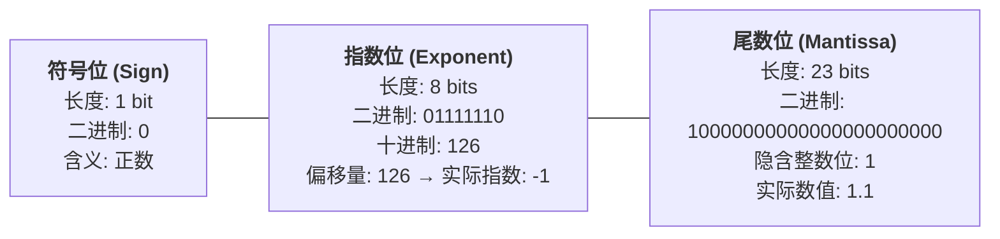
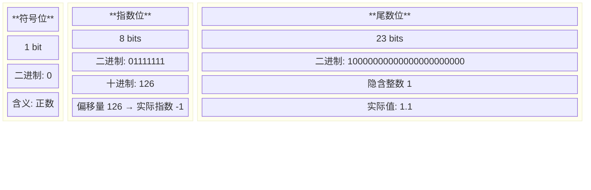
最终结果

$$ 1.1 \times 2 ^{-1} $$

#### 3.2 计算机计算出错

使用浮点数来处理小数，是造成出错的原因。

应对出错，有两种方式：
* **回避策略**，在某些应用场景，微小的差错并不会造成实际问题，可以直接忽略。
* 换算成整数来处理。计算机在计算整数时，是不会出错的。因此可以把小数换算成整数来处理。

#### 3.3 二进制和十六进制

用位作为单位来表示数据时，使用二进制很方便。但如果位数太多，看起来的理解成本就会更高。

在多数编程语言中，在数字开头加上 `0x` 就可以表示这是一个十六进制数。

`00111101110011001100110011001101` 表示成 `3DCCCCCD` 的十六进制 8 位数。

使用十六进制数来表示二进制小数时，小数点数后的二进制数的 4 位也同样相当于十六进制的 1 位。

`1011.011` 通过补 0 来表示。`1011.0110` 换算成 16  位数 **`B.6`**

## 四、内存

### 1. 内存的物理机制

内存实际上是内存 IC 的电子元件。

内存 IC 里有电源、地址信号、数据信号、控制信号等用于输入输出的大量引脚（IC 的引脚），通过为其指定地址，来进行数据的读写。

ROM 只能读取的内存。

RAM 是可以被读取和写入的内存。

VCC、GND 电源
A0 到 A9：地址信号
D0 到 D7：数据信号
RD、WR：控制信号

数据信号引脚 D0-D7 有 8 位，表示一次可以输出 8 位 1 字节的数据。
地址信号引脚 A0-A9 有 10 个，表示可以指定`0000000000-1111111111`共 1024 个地址。

RD 是读取，WR 是写入。

### 2. 内存的逻辑模型

编程语言里的数据类型，表示存储的是什么类型的数据。从内存角度，就是占用的内存大小。

### 3. 指针

指针表示存储数据的内存的地址。

### 4. 高效使用数组

数组是指多个同样数据类型的数据在内存中连续排列的形式。

数组和内存的物理构造是一样的。

### 5. 栈、队列和环形缓冲区

栈和队列都是不通过指定地址和索引来对数组的元素进行读写。

栈是先进后出。
队列是先进先出。
在内存中，预留出栈和队列所需要的空间，而且确定好写入和读出的顺序，就不用再指定地址和索引了。

#### 5.1 入栈和出栈演示

LIFO

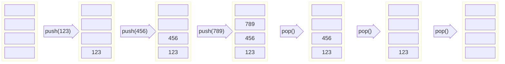

#### 5.2 队列的演示

FIFO

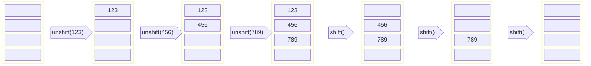

队列通常使用环状缓冲区来实现的。

##### 5.2.1 环状缓冲区

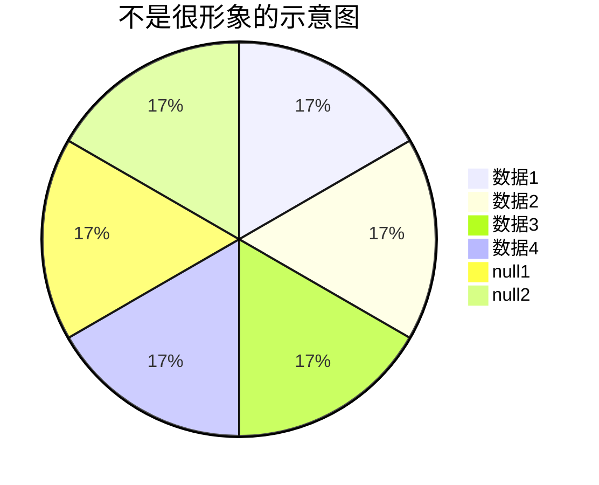

### 6. 链表

链表在存储原始数据的基础上，会存储指向下一个数据地址的索引。
* 链表在追加和删除元素的场景下，效率非常高。

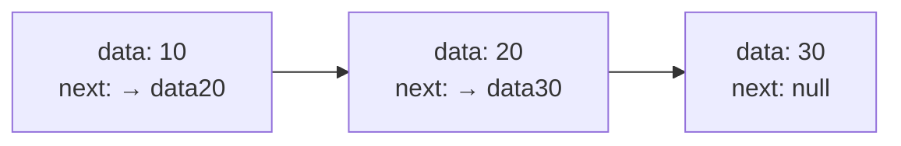

插入数据，直接把地址指向新的数据

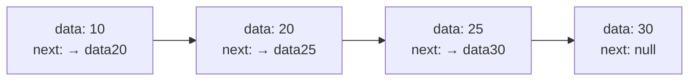

删除数据，直接把地址的指针索引，改为下一个


### 7. 二叉树

二叉树在链表的基础上，往数组里追加元素时，考虑到数组的大小关系，将其分成左右两个方向的表现形式。

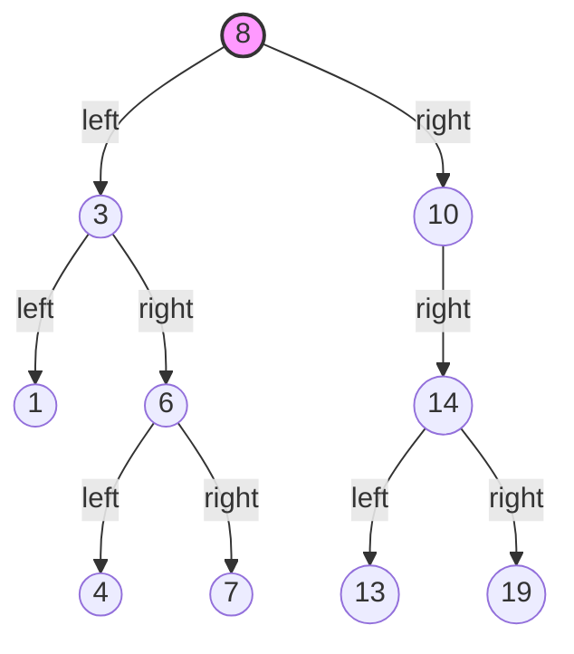

## 五、内存和磁盘

### 1. 必须读取内存来运行程序

存储在磁盘中的程序，需要读取到内存里才能运行。

### 2. 磁盘缓存能够加快磁盘访问速度

磁盘缓存是把从磁盘中读出的数据存储到内存空间中的方式。
* 核心逻辑是把低俗设备的数据存储在高速设备中。
* Web 浏览器也是使用的这样的逻辑来缓存。

### 3. 虚拟内存把磁盘作为部分内存来使用

虚拟内存是把磁盘的一部分作为假想的内存来使用。
* 磁盘缓存是假想的磁盘（实际上是内存）
* 虚拟内存是假想的内存（实际上是磁盘）

借助虚拟内存，在内存不足时也可以运行程序。
* 在只有 8G 内存空间的设备上运行 12G 的程序。

为了实现这个虚拟内存的效果，必须把实际内存（物理内存）的内容和磁盘上的虚拟内存的内容进行置换（swap），同时运行程序。

虚拟内存机制，分为**分页式**和**分段式**。

#### 3.1 分页式

Windows 使用分页式，在不考虑程序构造的情况下，把运行程序按照一定大小的页，进行分割，并且以页为单位在内存和磁盘间进行置换。
* 磁盘内容读取到内存是 `Page In`
* 内存的内容写入到磁盘是 `Page Out`
* Windows 的设备的页大小，通常是 **4KB**

##### 3.1.1 分页式虚拟内存的机制

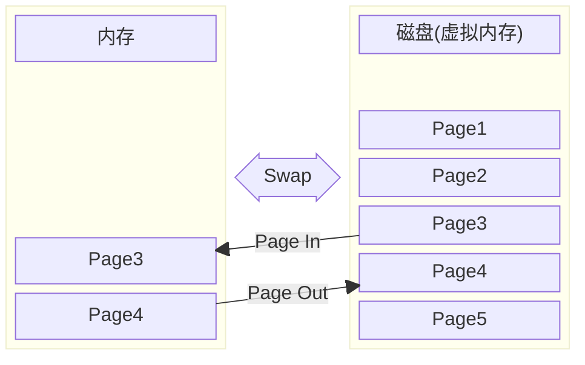

### 4. 如何节约内存

#### 4.1 通过 dll 文件共享函数

dll 是在程序运行时可以动态加载 Library 的文件。
#### 4.2 调用 `_stdcall` 来减少文件的大小

`_stdcall` 是 C 语言特有的方法。执行栈清理处理指令。
把不需要的数据从接收和传递函数的参数时使用的内存上的栈区域中清理出去。

### 5. 磁盘的物理结构

磁盘是把物理表面划分成多个空间来使用的。划分的方式是**扇区方式**和**可变长方式**。
* 扇区方式把磁盘划分为固定长度的空间。
* 可变长方式把磁盘划分为长度可变的空间。

#### 5.1 扇区方式

通常 Windows 计算机使用的硬盘和软盘，使用的都是扇区方式。
扇区方式里，把磁盘表面分成多个同心圆的空间就是**磁道**，把磁道按照**固定大小**（**存储的数据长度相同**）划分的空间就是**扇区**。
* 扇区是对磁盘进行**物理读写**的最小单位。
* Windows 的磁盘一个扇区一般是 512 字节。

##### 5.1.1 簇

在逻辑上，Windows 对磁盘进行读写的单位是扇区整数倍簇。
* 根据磁盘容量不同，一簇可以是 512 字节，也可以是 1KB，或者 2KB、4KB、8KB、16Kb。
* 在软盘里，簇和扇区的大小是相等的。

例如簇的最小单位是 512 字节，保存一个最简单的文本文件，里面只有一个字符，也需要占用 512 字节。簇是磁盘保存的最小单位。

## 六、压缩数据

### 1. 文件以字节单位保存

文件是字节数据的集合。

### 2. RLE 算法的机制

数据乘以重复次数的方法就是 RLE 算法。

### 3. RLE 算法的缺点

在文本文件里，数据里重复的字符的频率并不高，有些文本文件甚至在压缩后可能会更大。

RLE 算法对图片压缩有着比较好的效果。

### 4. 哈夫曼压缩算法

#### 4.1 莫斯编码

要理解哈夫曼压缩算法，先要理解莫斯编码。

**莫斯编码把一般文本里出现频率高的字符，用短编码来表示。**
* 这里的出现频率，指的是印刷行业里印刷的字符数，而不是出版物里的文章的字符数。
* 因为计算机是以 8 位为单位在文件中存储的，所以不满 8 位的短编码最终还是会以 8 位形式存储。

##### 4.1.1 莫斯编码和位长

这里的位数据，对应的是物理波形。

###### 字母表（A – F）

| 字符  | 莫斯码  | 物理位数据 (1=通, 0=断, 划占2格) | 位长  |
| :-: | :--: | :--------------------: | :-: |
|  A  |  .-  |          1011          |  4  |
|  B  | -... |        11010101        |  8  |
|  C  | -.-. |       110101101        |  9  |
|  D  | -..  |         110101         |  6  |
|  E  |  .   |           1            |  1  |
|  F  | ..-. |        10101101        |  8  |

###### 间隔信号

|     类型     | 物理位数据 (无信号=0) | 位长  |
| :--------: | :-----------: | :-: |
| 字母间隔（字符之间） |      00       |  2  |
| 单词间隔（单词之间） |    0000000    |  7  |

#### 4.2 用二叉树实现哈夫曼编码

 **哈夫曼算法是指，为压缩对象文件分别构造最佳的编码体系，并以该编码体系为基础来进行压缩。**

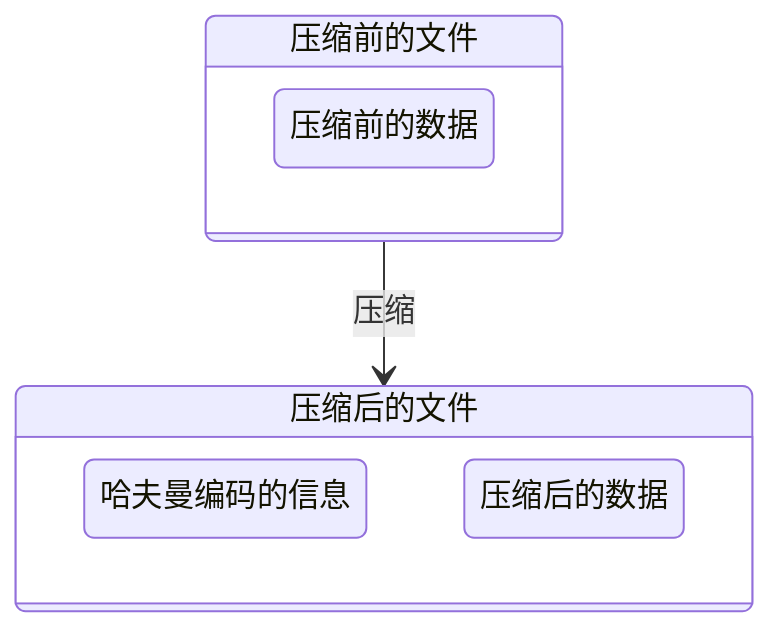

##### 4.2.1 举例实现

对这样的字符实现哈夫曼编码 `AAAAAABBCDDEEEEEF`

| 字符  | 出现频率 | 编码方案 | 位数  |
| --- | ---- | ---- | --- |
| A   | 6    | 0    | 1   |
| E   | 5    | 1    | 1   |
| B   | 2    | 10   | 2   |
| D   | 2    | 11   | 2   |
| C   | 1    | 100  | 3   |
| F   | 1    | 101  | 3   |

按照出现的频率逐渐降低，所需的编码位数逐渐增加。从 1 位增加到 3 位。

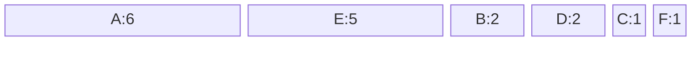

按照出现频率，从左到右依次排序后，使用二叉树的方式连接。下面是第一步

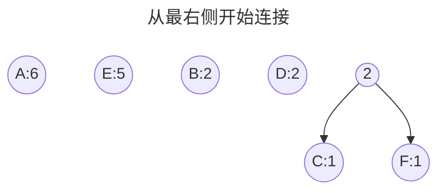

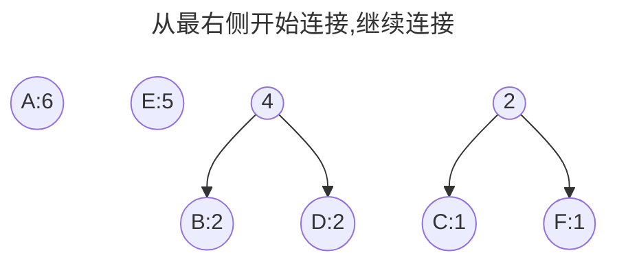

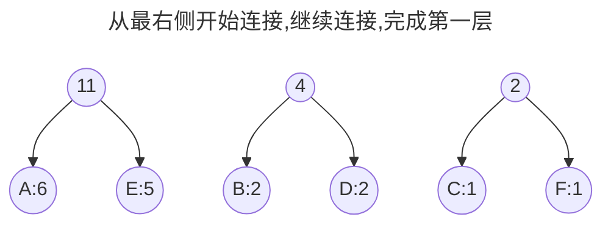

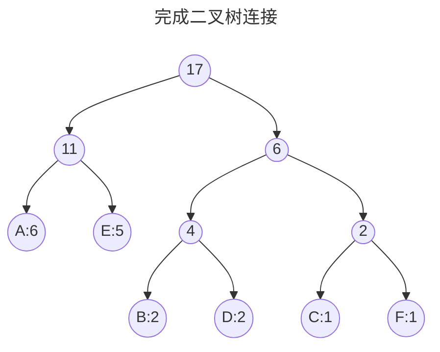


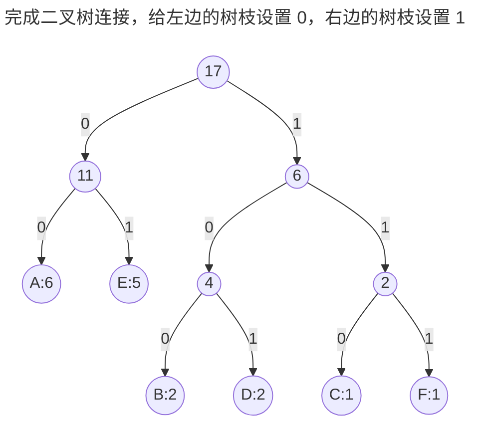

从上往下编码，得到最终的编码结果：

```mermaid
block-beta

columns 17
	A["A:6"]:6
	E["E:5"]:5
	B["B:2"]:2
	D["D:2"]:2
	C["C:1"]:1
	F["F:1"]:1

space:17

A1["A:00"]:2
E1["E:01"]:2
B1["B:100"]:3
D1["D:101"]:3
C1["C:110"]:3
F1["F:111"]:3

A --> A1
E --> E1
B --> B1
D --> D1
C --> C1
F --> F1
```

```mermaid
---
title: 最终的编码结果
---
flowchart TB
A((A:00))
E((E:01))
B((B:100))
D((D:101))
C((C:110))
F((F:111))
```

##### 4.2.2 提升压缩比率

原始字符串 `AAAAAABBCDDEEEEEF`，压缩后，**`00000000` `00001001` `00110101` `10101010` `10101111`** 占用 40 位，5 字节。原来的字符串占用 17 字节。
* 以 8 位作为分隔，只是为了方便对应查看

压缩比率为：**`5/17 = 29%`** ,达到了非常好的效果

哈夫曼编码对常见文件类型的压缩比率
* 文本文件：28%
* 图像文件：10%
* EXE 文件：19%

空间

### 5. 可逆压缩和非可逆压缩

能够把数据还原到压缩前的状态的压缩称为可逆压缩；
无法还原到压缩前状态的压缩称为非可逆压缩。
* JPEG 格式的文件是非可逆压缩。
* PNG/GIF 文件是可逆压缩，但是 GIF 有色数量无法超过 256 色的限制，所以还原后色彩信息会缺失，进而导致图像模糊。

```mermaid
---
title: 可逆压缩
---
flowchart LR

A["压缩前的文件"]
B["压缩后的文件"]
C["还原后的文件"]

A --压缩--> B
B --还原--> C
A <--幂等--> C
```

```mermaid
---
title: 非可逆压缩
---
flowchart LR

A["压缩前的文件"]
B["压缩后的文件"]
C["还原后的文件"]

A --压缩--> B
B --还原--> C
C --一部分数据丢失--> A
```

## 七、程序的运行环境

### 1. 
## 八、

## 十三

```mermaid
mindmap
	Root(根目录)
		A{{一、CPU 是什么}}
			1[1.CPU 的内部结构]
				1.1["**1.1 寄存器、控制器、运算器、时钟**"]
					1.1.1 [1.1.1 寄存器负责暂存指令、数据等处理对象，是内存的一种。]
					1.1.2 [1.1.2 控制器负责把内存上的指令、数据等读入寄存器，并根据指令的执行结果来控制计算器。]
					1.1.3 [1.1.3 运算器负责运算从内存读入寄存器的数据。]
					1.1.4 [1.1.4 时钟负责发出 CPU 开始计时的时钟信号。]
						c["时钟信号的频率越高，CPU 运行速度越快。单位是 ***GHz***."]
			2[2.CPU 是寄存器的集合体]
				2.1["2.1 CPU 内有多个寄存器，不同的寄存器的数量、种类和存储的数值范围都是不同的"]
					累加寄存器
					标志寄存器
					程序计数器
					基址寄存器
					变址寄存器
					通用寄存器
					指令寄存器
					栈寄存器
			3[3. 程序计数器决定着程序的流程]
				每运行次程序，程序计数器就会加一。
			4[4. 条件分支和循环机制]
				4.1 顺序执行是按照地址内容的顺序执行指令。
				4.2 循环是指重复执行同一地址的指令。
				4.3 条件分支是指根据条件执行任意地址的指令。
				4.4 条件分支和循环中，使用跳转指令来实现。借助标志位寄存器的结果，来判断是否要进行下一步操作，例如下一条件或终止循环。
					程序中的比较指令，实际上就是在 CPU 内部做减法运算，用结果再和 0 比较。
```