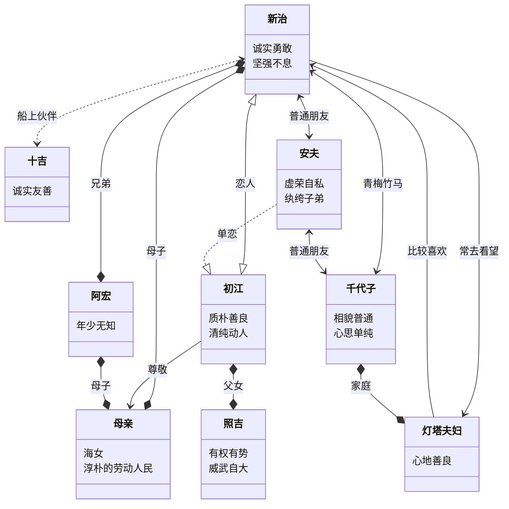
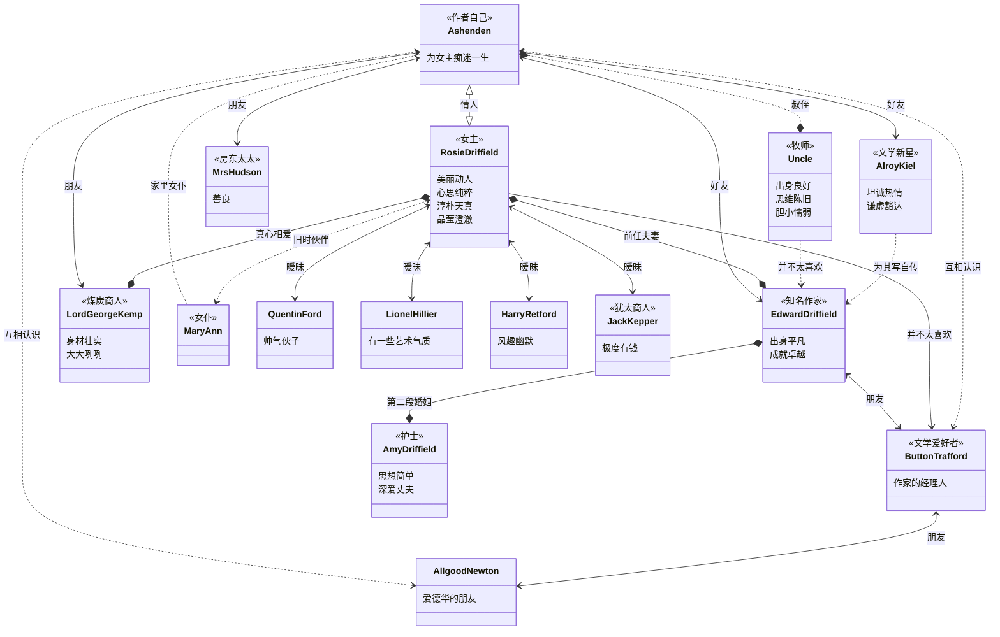

# Reading-List &middot;  

> The books I have read.

## 索引

- [2021](#2021)
- [2020](#2020)
- [2019](#2019)
- [2018](#2018)
- [2017](#2017)
- [2016](#2016)

## 2022

### 文学

1.[《变形记》](https://book.douban.com/subject/35218475/) - 2022.01.09 [@弗朗茨·卡夫卡](https://book.douban.com/author/4539732/)

中学时期通过节选赏析和阅读理解来学习变形记，记忆中主要关注的是格里高尔变成甲壳虫故事本身的荒诞性。成年多年后再读，我体会到一位家中顶梁柱在遭受如此变化后的心酸。他以一己之力将整个家庭带入更好的水平里生活，但我在字里行间没有阅读到这个家对他的感恩，更多的则是理所当然。工作多年后阅读这样的格里高尔，无法不会代入。我早已忘了这篇小说在曾经的阅读理解里的答案是什么，它有着怎样的隐喻。我只看到家中的顶梁柱在某次离奇的变故中倒塌，而其他人则慢慢减少对他的依赖乃至变成对它的厌恶。甚至在某个时刻，我以为他会变回，或者说我希望它变回来，结束它作为虫时的自责和不甘。然后故事并没有，在一次荒诞的变身之后，所有事物的发展都如此这般自然，直至格里高尔的死去。

 
 

2.[《潮骚》](https://book.douban.com/subject/35365849/) - 2022.01.27 [@三岛由纪夫](https://book.douban.com/author/4508171/)

第一次尝试梳理人物关系图。我尝试过使用备忘录和思维导图，还有前端图表库，只是呈现的方式我都并不十分满意。于是在找到合适的方式记录之前，我先试着用笔梳理人物关系。因为这是一部中篇小说，篇幅不大，寥寥七万字而已，因而里面的人物关系也并不复杂。我先试着用笔记录，尽管丑陋了些，但自己倒也印象更深刻些。
2022.02.05 更新 目前确认可以使用 <b>mermaid</b> 的类图来绘制人物关系，效果如下所示。

* 部分摘录。

  > 海，就是他们生息的场所。这里虽然没有起伏的稻穗和麦浪，但却有变幻不定的银波碧涛，在这片柔土般的领地上漂流翻卷。
  >
  > 看了这对乳房的女人不会再怀疑，因为这绝不是男人饱享过的乳房。这对乳房犹如蓓蕾初绽，一旦盛开，那胸脯该是多么迷人啊。

3.[《寻欢作乐》](https://book.douban.com/subject/30330186/) - 2022.02.06 [@毛姆](https://book.douban.com/author/4576950/)

这部类自传性质的小说，总是会令人回想起自己的初恋篇章。通读下来，可以明显感受到这本书的核心在于罗茜，所有的人事物都围绕着她展开，而她个人也散发着难以言述的魅力。在她身上，你可以感受到光芒，但不是万丈，也并不刺眼，却让人倍感温暖与温馨，让人自然而然地涌现爱意。她就像是纯爱的化身，但并不为爱所束缚。她的爱独一无二，却也让旁人心生嫉妒。爱上她的人，都想独占她，却又总是爱而不得，她像个精灵一样难以捉摸。也许有过几个夜晚那样轰轰烈烈，但更像是年老时值得回味的美妙片段，而不是终生的陪伴。每一位男人年少时，或许都想遇见这样一位“完美”情人。她不会成为你生命中的另一半相伴终生，但能成为让你终生想念的人生点缀。我猜，作者大约就是这样。

 
 

* 部分摘录。

  > 他笔下的恶棍总是那么邪恶，他笔下的英雄总是那么高尚，他笔下的少女总是那么贞洁。 015
  >
  > 当他从她们明亮的眼睛里看到结婚登记处的影子时，他就告诉她们，他对自己唯一的那次苦恋记忆太深，这使他永远无法和任何人结成终身伴侣。 017
  >
  > 过了三十岁的人居然还恋爱，我觉得相当令人恶心。 078
  >
  > 一个人如果在四十岁的时候就是一个政客，那么等他到了七十岁的时候就会成为一个政治家。这个年龄的人去当职员、花匠或者治安法庭推事都嫌太老了，但却正好适合来治理国家。其实这也不足为奇，你只要想想一个人自幼年的时候起，老一辈的人就反复向他强调说年长的人总比年轻的人聪明，而等年轻人最终发现这种说法有多荒谬的时候，他们自己也已经老了，于是觉得把这种骗术进行下去对他们会有好处；再说，凡是在政界活动的人都会发现（如果从结果来看的话），统治国家其实并不需要多少智力。 126
  >
  > 他的作品应该具有这样一种效果，即如果他无法以他作品的魅力打动读者，那也应当以其重量使读者感到震惊。 127
  >
  > 你头一次见到她的时候，她只是一个气色鲜艳、体态丰满的乡下女人，是我把她变美的。 188
  >
  > 有时候，她感觉到我在看她，于是转过头来，直盯着我的脸看上一会儿。她没有说话。我不知道她在想什么。 190
  >
  > 她的笑声并不含有任何轻蔑或伤害我的感情的意思，相反显得又坦率又亲切，仿佛她这么笑是因为她喜欢我。 191
  >
  > 我悄悄地用胳膊搂住她的腰，她转过脸来望着我。这一次是我开始吻她。她没有动；她那柔软鲜红的嘴唇平静而热烈地默默接受着我压上去的嘴唇，好似一片湖水接受着皎洁的月光。我不知道我们在那儿到底待了多久。 193
  >
  > 当我想到我是她的情人的时候，心里不禁激动地感到有些飘飘然。 200
  >
  > 这并不是道德败坏，也不是生性淫荡；这是她的天性。她把身体交给别人，好似太阳发出热量、鲜花发出芳香一样自然。她觉得这是一件快乐的事，而她也愿意把快乐带给别人。这丝毫无损于她的品格，她仍然那么真诚、淳朴、天真。 257
  >
  > 对于永恒的心灵而言，一个人一生的痛苦和奋斗只不过是个笑话而已。 258
  >
  > 我就思考起作家的生活来。那真是饱经忧患。开始的时候，他必须忍受贫困和世人的冷漠；等到取得了一些成就，他必须神色欣然地应付任何意想不到的情形。他的成败有赖于喜怒无常的公众。他得听凭所有下面这些人的摆布：记者们采访他，摄影师要为他照相，编辑催他交稿，税务官催他交所得税，身份高贵的人请他去吃午饭，协会秘书请他去演讲；有的女人想嫁给他，有的女人要和他离婚；年轻人要他的亲笔签名，演员要求在他的戏里扮演角色，素不相识的人问他借钱，感情冲动的女士征求他关于婚姻方面的意见，态度认真的年轻人要他指点他们写作，还有经纪人、出版商、经理、令他厌烦的仰慕他的人、评论家以及他自己的良心。可是他可以得到一种补偿。无论何时，只要他心里有什么事情，不管是令他心神不安的某种想法，好友亡故的哀痛，得不到回应的相思，受到伤害的自尊心，还是对一个他曾好心相待的友人背信弃义的愤怒，总之，只要心中产生一种激情或一种令他困惑不解的想法，他只需要把它写成白纸黑字，用它作为一个故事的主题，或是一篇散文的点缀，好最终把它彻底忘却。他是唯一自由的人。 276

4.[《仲夏之死》](https://book.douban.com/subject/30330186/) - 2022.06 [@三岛由纪夫](https://book.douban.com/author/4508171/)

读完两个月了，也写不出什么感受。感到自己的词汇很贫瘠，没法描述，也没有什么旺盛的表达欲。读完一篇，心想，哦，还不错，就无言继续阅读着了。这部中短篇小说合集，更像是作者的练笔之作。毕竟作者也这么坦言道。可能文字有创造力，全篇却不够成熟吧。不过可以想象到，这是一本适合在旅途中解闷的书。当你坐在长途列车上闷热着难眠或无趣的时候，拿出这样一本小书，或许可以解解乏，消消暑，毕竟装帧是精美的，内容是有趣而易忘的。

 
 
 
 
 

5.[《如何阅读一本书》](https://book.douban.com/subject/1013208/) - 2022.09.30

TODO: 嗯，总得写点什么，但暂时还没有想好

 

* [整理的大纲笔记（文字版）](https://github.com/kyriejoshua/reading-list/blob/master/2022/%E3%80%8A%E5%A6%82%E4%BD%95%E9%98%85%E8%AF%BB%E4%B8%80%E6%9C%AC%E4%B9%A6%E3%80%8B/%E3%80%8A%E5%A6%82%E4%BD%95%E9%98%85%E8%AF%BB%E4%B8%80%E6%9C%AC%E4%B9%A6%E3%80%8B%E5%A4%A7%E7%BA%B2%E7%AC%94%E8%AE%B0.md)
* [章节练习记录](https://github.com/kyriejoshua/reading-list/blob/master/2022/%E3%80%8A%E5%A6%82%E4%BD%95%E9%98%85%E8%AF%BB%E4%B8%80%E6%9C%AC%E4%B9%A6%E3%80%8B/%E3%80%8A%E5%A6%82%E4%BD%95%E9%98%85%E8%AF%BB%E4%B8%80%E6%9C%AC%E4%B9%A6%E3%80%8B%E7%AB%A0%E8%8A%82%E7%BB%83%E4%B9%A0%E8%AE%B0%E5%BD%95.md)
 
 

6.[《美丽新世界》](https://book.douban.com/subject/27002046/) - 2022.10 [@阿道司·赫胥黎](https://book.douban.com/author/4584692/)

阅读全书之后，让我印象更为深刻的不是本书的重点《美丽新世界》，反而是后面的篇章《重返美丽新世界》。这个篇章的内容是许多年后，作者对自己所写的小说内容的进一步思辨。自己有这样的感受可能是因为直出的议论更容易理解。作为长文的小说而言，所有的情节发展和人物设计，都把主题放在了更隐晦的地方。就印象流而言，我觉得《一九八四》的小说内容更为让人震撼。并不是这本书的内容不够好，而是以现代的眼光来评判小说的设计，总是会觉得有过时的部分，以至于代入感不够，这当然不是原书的问题。每本书都因为作者所处的时代而有其局限性，无可厚非。而作者在本书后期讨论的内容，却更加普适，甚至能够代入当今的社会。也即小说的故事内容背景可能会随时代变迁而过时，但主题终究是深刻的。

多提一句，这本书在豆瓣竟然是不可以记笔记的，实属讽刺。希望这只是豆瓣一个微不足道的愚蠢的 bug, 而不是自我审查的结果。

* 部分摘录。

> 第一章：人口过剩
> 我们这个时代的梦魇源于没有秩序，而《美丽新世界》的梦魇源于过度秩序化。从一个极端到另一个极端应该会经历漫长的过渡时期，在我的想象中，这一时期，那三分之一的幸运儿将会充分利用好这两个世界——奉行自由主义的无序的旧世界与过度秩序化的完美高效的消灭了自由和个人主动性存在空间的美丽新世界。
>
> 根据我们对动物行为的大体了解，特别是对人类行为的了解，显然，从长远来看，通过惩罚手段去控制不合乎要求的行为不如通过奖励对合乎要求的行为进行强化来得有效。而且，大体上，以恐怖手段实施统治的政府不如以非暴力的手段对环境与男女老少的思想和情感实施操纵的政府那么运作有效。惩罚暂时能够停止不合乎要求的行为，但无法永久消除被惩罚者沉溺其中的念头。
> 《一九八四》的寓言所描写的社会是一个几乎完全通过惩罚和对惩罚的恐惧实施控制的社会。而在我所设想的世界里，惩罚并不经常发生，而且大体上很温和。由政府实施的近乎完美的控制是通过多种多样的几乎非暴力的身心控制、基因标准化和对合乎要求的行为进行系统性的强化而实现的。
>
> 即使是最贫穷的政府也有钱为其人民实施深入的死亡控制。而生育控制则是另外一回事。一个仁慈的政府只要出资雇几个技术人员就能够为全民提供死亡控制。而生育控制则取决于全体国民的配合。它必须由不计其数的个体奉行节育，所要求的智慧和意志力是世界上人数众多的文盲所不具备的，而且（在使用化学或机械手段避孕的情况下）所要花费的金钱也是这数亿人中绝大多数人承担不起的。此外，没有任何宗教或社会传统会赞成滥杀，而提倡不受节制的生育的宗教和社会传统则影响深远。正是基于这些原因，死亡控制可以轻易实现，而生育控制的实现则很困难。【批注，作者的这段评论没想到在某国失效了，而且恰恰是通过他认为不够有效的惩罚手段来实现的】
>
> 登月对于强大的国家来说或许会带来军事优势，但它并不能改善生活。
>
> 在英国或美国，这个体制运作得很好，因为它们有尊重宪法程序的传统。而在共和精神或限制君权的传统薄弱的国家，即使是最完善的宪法也无法阻止野心勃勃的政客心醉神迷地屈服于权力的诱惑。在任何国家，当人口的数量对可利用的资源带来沉重的压力时，这些诱惑必定会出现。人口过剩导致经济萧条和社会动荡。而动荡和萧条又会导致中央政府实施更多的管制和强化她们的权力。如果没有宪政传统，权力的加强或许将以独裁专制的形式出现。由于人口过多导致动荡致使独裁势力崛起几乎是不可避免的事情。我敢打赌，再过二十年，全世界的人口过剩的不发达国家将会陷入极权主义统治之下。
>
> 第三章：过度组织化
> 组织是不可或缺的，因为只有在一个由自由合作的个体组成的实行自我管理的社区里，自由才能存在和拥有意义。但是，尽管不可或缺，组织也可能是致命的。过度的组织会将男人和女人变成自动机器，扼杀创新精神和毁灭自由存在的可能。和以往一样，唯一的安全途径是在自由放任和完全控制这两个极端之间找到一条中庸之道。
>
> 过度组织化的非人性化的作用强化了人口过多的戕害人性的作用。随着工业的扩张，越来越多的人口被吸引到大城市，但大城市的生活并不利于精神健康（据说精神分裂症发生频率最高的地方就是人口密集的工业贫民窟），也无助于培育在自治小群体中负责人的自由，而它是民主体制的前提条件。城市生活是匿名性的，也是抽象的。
>
> 《美丽新世界》所描述的社会是一个世界统一的国家，战争已经被消除，统治者的首要目标是不惜一切代价让被统治者不制造麻烦。这一点他们通过合法化一定程度的性自由（通过废除家庭）以及其他手段，基本上保证生活在美丽新世界里的人不会有任何形式的毁灭性（或创造性）的情感压力。在《一九八四》里，权力欲通过施加痛苦而得到满足，而在《美丽新世界》里，则是通过给予快乐，但同样是对人的侮辱。
>
> 呜呼，高等教育并不一定能保证更高尚的品格或更高明的政治智慧。
>
> 第四章：民主社会中的宣传
> 民主制度是在尊重个体自由和主动性的基础上协调社会的机制，并让国家的统治者的直接权力臣服于被统治者的最高权力。
>
> “没有哪一个愚昧的国家能够保持自由，”杰弗逊说道，“过去如是，将来亦如是……没有信息人民就没有安全。在媒体自由的地方，每个人都有识字能力，所有人都会平安无事。”
>
> 只有警醒的人才能够维护他们的自由，只有那些一直理智地活在当下的人才能有望通过民主制度实现自我治理。一个社会的绝大多数成员如果大部分时间不是活在当下和可预测的未来，而是生活在虚无飘渺的运动、肥皂剧、神话构建的奇幻迷离的世界里时，将很难抵挡想要操纵控制他们的人一步步的侵蚀。
>
> 今天的独裁者在宣传中主要依靠重复、镇压和文过饰非一一重复他们希望被当成真理接受的口号，镇压他们希望忽略的事实，激情的唤醒与合理化或许会为了党派或政府的利益而被利用。随着操纵的艺术和科学得到更深人的了解，无疑，末来的独裁者将学会将这些技术与无休止的消遺结合在一起。在西方，它们正构成威胁，将维护个体自由和民主制度的理性宣传淹没在无关紧要的琐事的海洋中。
>
> 第六章： 贩卖的艺术
> 民主的生存依赖于有许多人能够在获得充分信息的情况下作出现实的选择。而独裁体制则通过内容审查和歪曲事实维护自己的统治，不是诉诸理性思考或开明的自我利益，而是诉诸激情与偏见，诉诸希特勒所说的潜伏在每个人的无意识恩想深处的强大的 “隐藏的力量”。在西方，民主原则被广泛宣传，许多能干而且有良知的宣传人员尽自己的最大努力为投票者提供充分的信息并以理性的辩论说服他们，希望借助这些信息让他们作出务实的抉择。所有这些都会造福社会。但不幸的是，西方民主国家的宣传，尤其是美国，具有两面性和人格分裂。
>
> 第七章： 洗脑
> 政治与宗教宣传的效果取决于它们所采用的方式，而不是所传授的信条。这些信条或许是对的，或许是错的，或许是合理的，或许是有害的——但这些并不重要。如果灌输信条是在精神疲劳的适当时机以正确的方式实施，它就能取得成效。在条件理想的情况下，几乎每个人都可以被劝服信奉任何思想。
>
> 第十一章： 争取自由的教育
> 争取自由的教育必须以阐述事实与阐明价值观作为起点，而且必须制定合适的手段与实现这些价值，并与那些不管出于什么原因而选择忽略事实或否定价值的人作斗争。
>
> 或许光靠分析是无法找到并坚持轻信和怀疑一切之间的中庸之道的。这个负面性的手段必须以更加正面性的手段——阐述一组以事实为坚实基础的被普遍接受的价值——作为补充。首先是基于人的多样性和基因独特性的个体自由的价值，其次是慈善和怜悯的价值，基于古老而熟悉的事实和现代精神学的最新发现论人类的身心差异有多大，对于我们来说，爱就像食物与居所，是必不可少的。最后是思想的价值，没有了思想，爱将虚弱无力，而自由将无法实现。这组价值为我们提供了判断宣传内容的标淮。不合理性和有违道德的宣传会被断然拒绝。只是不合理性但与爱和自由相行不悖，而且原则上不妨害思想运作的宣传则可以被暂时接受。
>
> 第十二章：我们能够做些什么？
> 与此同时，世界上仍有自由存在。确实，许多年轻人似乎并不珍惜自由。但我们当中有人仍然相信，失去了自由，人就不能成为完整意义上的人，因此，自由就是最高的价值。或许现在威胁自由的力量实在是太强大了，没办法长久地抵抗下去，但不管怎样，我们的责任就是尽自己的能力进行抵抗。

7.[《请你安静些，好吗？》](https://book.douban.com/subject/35653981/) - 2022.10 [@雷蒙德·卡佛](https://book.douban.com/author/320790/)

卡佛总是钟情于生活，生活里的各种小事。它们可以是聚会里无聊的吵闹、朋友间暗生的情愫、感情的欺骗；中年夫妻平淡的婚姻和难忘的外遇;在圆满的家庭里丢掉一条吵闹的杂种的狗；让人失望的乡下生活。只有他对这些琐事的理解到了一种令人惊叹的地步，才能写出如此细致形象的故事篇章。

 

卡佛的小说里，对平凡的人物不会有过多的形象刻画，但通过一段段简洁而真实的对话，我们会逐渐清楚地了解这些小人物他们所面临的困境以及他们束手无策的处境。天呐，我真的很想知道他是不是就藏在一个个家庭里的角落，用摄像机般的眼睛记录到脑海里，再把他们转为他笔下的小说，他笔下一个个性格鲜明的人物。

 

如果我是一位文学评论家，我会想着试图分析那些稀松平常就发生在我们周围的故事里，想要透露出什么信息。幸好我不是，我没有那样的造诣。作为普通的小说爱好者，我从一篇篇极度现实的短篇小说里，看到的是一个个不同的家庭背后隐藏的破碎。对了，我想到了，就是这种破碎。在这本书里，处处是破碎、隐匿的破碎。平淡无奇的家庭生活里，总会埋藏着一些可能会破坏家庭的秘密，但它们无法永远埋藏。在某个不起眼的时候，它会找准时机浮出水面，你会惊讶于它浮出水面后身形的庞大，又或是它的内核所蕴藏着的巨大影响力。就像这本书的最后一篇小说，妻子两年前的外遇，却击垮了正当下的丈夫。他在得知一切之后，经历真实却又恍惚的一晚，然后再回到家，接受这一切，接受这现实的生活。

* 部分摘录

> 《学生的妻子》
> “如果要按顺序排的话我得想一想。但我喜欢坐飞机。离开地面的一刹那，你会有一切都无所谓的感觉…我喜欢晚上睡晚点，第二天早上赖在床上不起来。我希望我们呢个经常那样，而不是偶尔一次。我还喜欢做爱，喜欢在不经意时被爱抚。我喜欢看电影，过后和朋友一起喝喝啤酒。我喜欢交朋友。我非常喜欢简妮斯·亨德里克斯。我希望每周至少去跳一次舞。我希望总有漂亮的衣服穿，希望在孩子们需要时，不用等就可以给他们买衣服。劳里现在就需要一套过复活节的衣服。我也想给加里买一套小西服或类似的衣服。他长大了。我希望你也有一套新西服。其实你比他更需要一套新西服。我希望我们有自己的住房，不再每年或每隔一年就搬一次家。这是最大的心愿了。”她说，“我希望我们俩能过一种诚实的生活，不用去担心钱和账单之类的东西。你睡着了。”
>
> 《杰瑞、莫莉和山姆》
> 现在他有了外遇，看在老天的分上，他不知道如何是好。他不想继续下去，也不想就此罢手：暴风雨来临时，你也没必要把船上所有东西都扔到海里去。

### 技术

1.[《Javascript 高级程序设计》(第4版)](https://book.douban.com/subject/35175321/) - 2020.11.29 阅读中

核心章节已阅读 2021.07

 
 
 
 
 
 
 

- [x]  章节 9 Proxy 已阅读。[记录](https://github.com/kyriejoshua/javascript-study/blob/master/lib/Professional-JavascriptV4/part9.js) - 2022.08

2022 阅读计划

* 列一些书单，想到再补充。核心以技术类为主，文学为辅。
  * - [ ] JavaScript 高程及设计模式 第一季度核心阅读内容
  * - [ ] 算法与数据结构
  * …

### [2021](2021.md)
### [2020](2020.md)
### [2019](2019.md)
### [2018](2018.md)
### [2017](2017.md)
### [2016](2016.md)
### [STAR](star.md)
