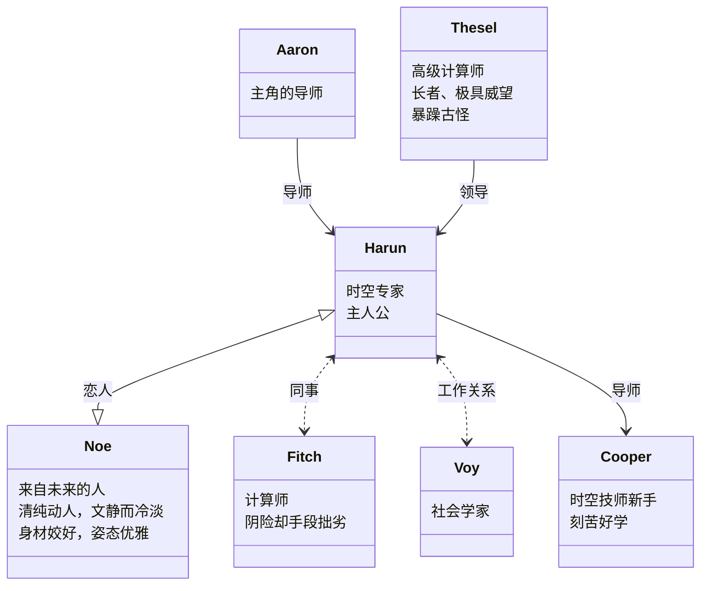

# Reading-List &middot;  

> The books I have read.

## 索引

- [2022](#2022)
- [2021](#2021)
- [2020](#2020)
- [2019](#2019)
- [2018](#2018)
- [2017](#2017)
- [2016](#2016)

## 2023

### 文学

##### 1.[《孙子兵法》](https://book.douban.com/subject/3985971/) - 2023.01.08 [@孙子](https://book.douban.com/author/4559301/)

孙子确实有着远远超出他那个时代的远见和谋略。

 
 
 
 
 

##### 2.[《永恒的终结》](https://book.douban.com/subject/25829693/) - 2023.01.14 [@[美] 艾萨克·阿西莫夫](https://book.douban.com/author/4556848)

比起它收到的赞誉，它给我的震撼不及那么多。期待有改编得更好的影视作品。

 
 
 
 

这本书的人物关系比较简单，对于性格的刻画也没有太费笔墨。在这本书里，更重要的是故事情节。

### 技术

1.[《Javascript 高级程序设计》(第4版)](https://book.douban.com/subject/35175321/) - 2020.11.29 阅读中

核心章节已阅读 2021.07

 
 
 
 
 
 
 

- [x]  章节 9 Proxy 已阅读。[记录](https://github.com/kyriejoshua/javascript-study/blob/master/lib/Professional-JavascriptV4/part9.js) - 2022.08

2023 阅读计划

* 列一些书单，想到再补充。核心以技术类为主，文学为辅。
  * - [ ] JavaScript 高程及设计模式 第一季度核心阅读内容
  * - [ ] 算法与数据结构
  * …

### [2022](2022/index.md)
### [2021](2021.md)
### [2020](2020.md)
### [2019](2019.md)
### [2018](2018.md)
### [2017](2017.md)
### [2016](2016.md)
### [STAR](star.md)
