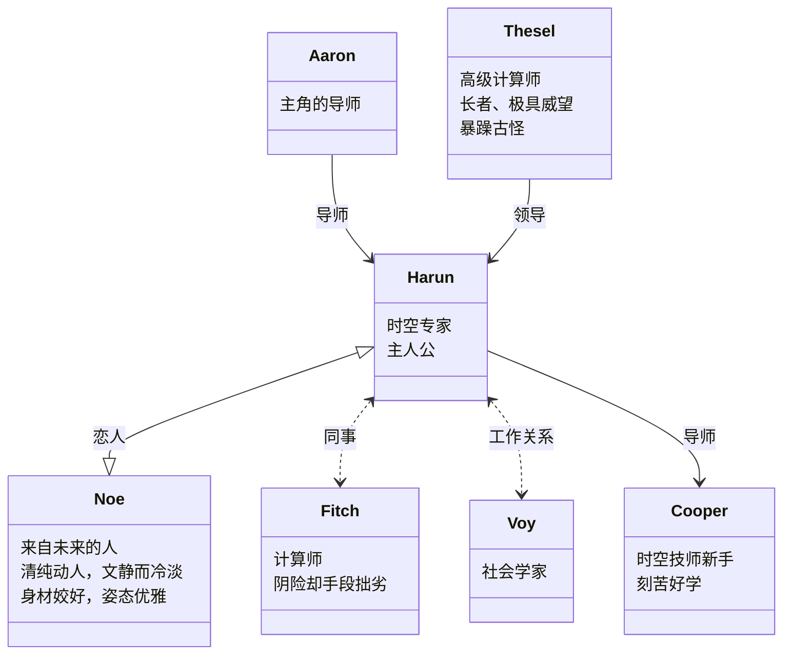

# Reading-List &middot;  

> The books I have read.

## 索引

- [2022](#2022)
- [2021](#2021)
- [2020](#2020)
- [2019](#2019)
- [2018](#2018)
- [2017](#2017)
- [2016](#2016)

## 2023

### 文学

#### 1.[《孙子兵法》](https://book.douban.com/subject/3985971/) - 2023.01.08 [@孙子](https://book.douban.com/author/4559301/)

	
RATE: ★★★☆☆
孙子确实有着远远超出他那个时代的远见和谋略。

 
 
 
 
 

#### 2.[《永恒的终结》](https://book.douban.com/subject/25829693/) - 2023.01.14 [@[美] 艾萨克·阿西莫夫](https://book.douban.com/author/4556848)

	
RATE: ★★★★☆
比起它收到的赞誉，它给我的震撼不及那么多。期待有改编得更好的影视作品。

 
 
 
 

这本书的人物关系比较简单，对于性格的刻画也没有太费笔墨。在这本书里，更重要的是故事情节。

#### 3.[《当我们不再理解世界》](https://book.douban.com/subject/36073906/) - 2023.01.31  [@[智利]本哈明·拉巴图特](https://book.douban.com/author/4616529/)

	
RATE: ★★★★☆

	
本书的文体随意杂糅，像是作者出于自己的想象，对史实进行戏剧化地续写，使其对应的人物事迹更富传奇色彩。

	
所有的篇章里，提到的每一位人物都是历史上名副其实的传奇。在某些篇章中，数位天才的交锋，激发出各自的潜力，创造出一个又一个的学术奇迹，引领着一个又一个时代的进步。又有一些篇章中，伟大的天才引领了人们，但也因无人能赏识自己的才华，或崩溃、或疯狂，最终留下在那个时代让人不得而知的世界难题。如书中所言，那些天才们，似乎是来加速人类智力的进化、文明的进步的。虽然有些传奇的评价褒贬不一，但整体而言，他们无疑对人类的发展做出了巨大贡献，值得后人为其记录续写。

	
这些故事中精湛的细节描写和细腻的心理活动，因其基于历史，也显得格外真实。整体的叙述则虽平实却饱满富有张力，如同娓娓道来，最终引人入胜，值得反复回味。

##### 部分摘录

> 《普鲁士蓝》 章节 09 页
> 用它完成的第一幅名作是彼得•范德韦尔夫于一七零九年创作的 《基督下葬》。在这幅画里，天空中的云将地平线遮蔽了，而掩着圣母脸孔的面纱泛着蓝莹莹的光，映出了围在弥赛亚遗体旁的使徒们的哀伤，基督裸露的身体苍白无比，竟把亲吻他手背的妇人的脸都给照亮了，她仍跪在那里，似乎想用嘴唇烙上他被铁钉拉开的伤口。
>
> 《普鲁士蓝》 章节 11 页
> 可他没能想到的是，在他过世的两百年后，到了二十世纪，它竟会在工业、医疗和化学领域拥有这么多的应用，以至于每个月都要生产这么多的足以毒死这颗行星上所有人的氰化物。
>
> 《普鲁士蓝》 章节 21 页
> 在空气中提取面包的人。
>
> 《普鲁士蓝》 章节 25 页
> 在弗里茨•哈伯去世时随身带着的少数几样东西里，人们发现了一封他写给妻子的信。在信中他坦言，他感到了一种难以忍受的内疚，但并不是因为他在这么多人的死亡中直接或间接地扮演了什么样的角色，而是说，他从空气中提取氮的做法改变了地球的自然平衡，他担心世界的未来将不再属于人类，而是属于植物，因为，只要世界人口缩减到前现代的水平，哪怕只有几十年，这些植物就会刹不住地疯长，借着人类遗留给它们的过剩的养分，到那时，它们就会在地球表面蔓延开来，直到将它彻底填满，把所有的生命形式都淹死在一片可怕的绿色里。
>
> 《史瓦西奇点》 章节 26 页
> “如您所见，战争对我足够仁慈。虽有炮火凶猛，我仍可以从一切中逃离出来，在您思想的土地上进行这次短暂的漫步。”
>
> 《史瓦西奇点》 章节 29 页
> 哪怕浸没在混乱的战争之中，奇点仍像一摊秘物，在他脑海中蔓延着，叠加在条条战壕织成的地狱之上，它出现在了战友们的弹伤里，倒在泥泞中的死马眼里，防森面具政璃的反射中。他的想象已经被他发现的那个东西给紧紧拽住了：他惊惶地意识到，但凡他的奇点存在，就会一直持续到宇宙的尽头。那些理想化条件把它变成了一个永恒之物，不增大也不缩小，而是水远保持原状。与其他所有事物都不一样的是，它不会随看时间而改令，且是义重不可逃脫的：在他创造的怪异的空间几何学中，奇点将同时位于时间的两端，不管你逃往的是最远的过去或未来，它永远都会在那里。
>
> 《史瓦西奇点》 章节 40 页
> 我听厌了其他那些当官的说辞，说我们离胜利越来越近了，战争结束已经指日可待了。他们都没发现吗，我们升得越高，只会摔得越惨？
>
> 《史瓦西奇点》 章节 43 页
> 在他测算出的那个孔洞里，宇宙基本参数交换着它们的性质：空间像时间一样流动，时间像空间一样延展。这种扭曲将因果律都改变了，卡尔推测，如果哪个假想的旅行者可以进人到这个稀薄区并且活下来的话，就能接收到未来的光与信息，见到还未发生过的事件。而他如果抵达了深洲中心，又没有被重力撕碎，就能见到两个重香的景象同时投射在他头顶的一个小圈里，就跟万花简一样：其中之一是以让人难以想象的速度激变着的宇宙的未来，而另一个，则是被冰结在某一瞬间的过去。
>
> 《心之心》 章节 54 页
> “就好像一颗核桃，泡在水里几个月之后，它就自行打开了”。
> 格罗滕迪克所做的是推广和一般化，拉远到极致。任何难题，只要撤到一个足够远的距离，就会变得十分简单了。他对数字、曲线、直线或任何具体的数学对象都不感兴趣，唯一重要的是它们的关系。“他对事物的和谐有种超凡的敏感性，”他的弟子之一，吕克 •伊吕西回忆道，“他不止是引人了新的技巧，证明了重要的定理，还改变了我们思考数学的方式。”
> 他痴迷空间，他最独到之处就是把“点”的概念给扩展了。在格罗滕迪克的注视下，卑微的点不再是没有面积的一个位置，而是从内部膨出了复杂的结构。别人眼里没有长宽高、没有大小的一个地方，亚历山大看到的是一整个宇宙。自欧几里得以降就再没有人提出过这么大胆的设想。
>
> 《心之心》 章节 54 页
> 多年来，他把全部精力都扑在了数学上，一天十二小时，一周七天。他不看报纸，不看电视，连电影院也设有去过。他喜欢丑陋的女人、朽坏的公寓、破败的房间。他常把自己关在一个冰冷的办公室里，背朝着唯一的窗户，墙漆都剩落了，整个屋里只有四样东西：他母亲的死亡面具、一只铁丝做的山羊、一箱西班牙橄榄，和他爸爸在勒韦尔集中营时人家给他画的像。
>
> 《心之心》 章节 57 页
> 他是个优秀的拳击手，狂热地爱好巴赫和贝多芬晚期的四重奏。 他热爱大自然，崇尚橄榄树的 “谦逊与长寿，充满阳光与生命力”。而在包括数学在内的世间万物中，他真正喜欢的还是写，以至于不让他写下来的话，他都没办法思考。他的狂热还体现在，他有好些手稿，笔都穿透了纸张。他会在本子里与下那些方程，然后一遍遍地描它们，描到都看不清了，单纯因为喜欢石墨搔挠纸张的那种生理上的快感。
>
> 《心之心》 章节 59 页
> “我看他讲课，我的第一印象是，他得是从哪个遥远的星系、哪个外星文明，专门传送到我们地球，来加速我们智力的进化的。”
>
> 《心之心》 章节 60 页
> “激励着我的不是野心或对权力的渴望，而是我灵敏地感觉到了某种巨大的、非常真实同时又非常微妙的东西。”格罗滕迪克还在继续把他的抽象推向愈发极端的界限，才刚攻克一个领域，他已在预备着扩张它的疆界。他研究的巅峰便是“动机”的概念：这是一束光，足以照映出一个数学对象的所有可能的化身。“心之心”，他是这样称呼位于数学宇宙中心的这个实体的，而关于它，我们所认识到的不过是它最遥远的闪烁。
>
> 《心之心》 章节 63 页
> “搞数学就像做爱一样。”格罗滕迪克写道。他的性冲动完全可以和他的精神追求相匹敌。他一生引诱过许多男人和女人，他和妻子米雷耶 • 杜福尔生了三个孩子，而婚外还有两个。
>
> 《当我们不再理解世界》 章节 89 页
> 假如它是正确的话，科学都不仅仅是理解了，而是可以在最根本的尺度上操纵现实。一想到这种性质的知识可能会带来怎样的后果，一阵强烈的晕眩就朝他涌了过来，他不得不克制住把本子扔进海里的冲动。他觉得，他已在透过各类原子现象望向一种新的美。他激动得不想睡觉，就走向一块直插大海的岩石，跳了上去，爬到尖端，就那样双腿悬空地坐在那里，听海浪拍打着崖壁，等待日出。
>
> 《当我们不再理解世界》 章节 103 页
> 他和安妮都有好几个情人，但都容忍着对方的不忠，平静地生活在一起。唯一让他良心不安的是他对才华的浪费。他从小智力优势就很明显：在学校里，他的成绩总是最好的，还不仅仅是他喜欢的科目，而是所有。他的同学们都习惯了，埃尔温什么都知道，以至于几十年后，其中有个人还记得小薛定谔没能答上来的唯一问题：黑山的首都在哪里？天才的名声一路伴随他来到了维也纳大学，他的本科同学在提到他的时候，用的词也是“那个薛定谔”。他对知识的渴求涵盖了科学的所有领域，包括生物和植物学，可他同时还痴迷于绘面、戏剧、音乐、语言学和经典作品研究。这种抑制不住的好奇，加上他在精确科学中展现出的显而易见的天赋，使得他的老师们都预言说，他会有个辉煌的未来。然而，随着时间一年一年地过去，那个薛定谔已经泯然众人。
>
> 《当我们不再理解世界》 章节 115 页
> 薛定谔想找个理由不让她走，这不是他第一次迷上一个这么年轻的女人，但赫维希小姐不一样，她身体里有种东西，让他原地缴械，卸下了他所有的自信。
>
> 《当我们不再理解世界》 章节 141 页
> 这就是薛定谔方程的天才之处：从某种意义上说，它用一个单一的框架——波函数——就把一个粒子的无数种命运、所有状态和轨迹，叠加在一起，给表示了出来。一个粒子有许多种穿越空问的方法，可它只能选择一种。如何选择的？完全随机。所以对海森堡来说，已经再没有办法绝对淮确地谈论任何亚原子现象了。以前是每个果都对应着一个因，而现如今，只剩下一堆概率。在物质最深层的基础之中，物理学找到的不是薛定谔和爱因斯坦心在物质最深层的基础之中，物理学找到的不是薛定谔和爱因斯坦心心念念的、被一位理性之神像提线木偶一样支配着的一个坚固不破的真实，而是一个神奇而瑰异的王国，一位用无数只手操弄着偶然的女神的肆意妄为的孩子。

#### 4. [《欧·亨利短篇小说精选》](https://book.douban.com/subject/26303655/) - 2023.03.05  [@[美]欧·亨利](https://book.douban.com/author/4507666/)

	
RATE: ★★★★☆

	
可以预想到，在 20 世纪初的那个年代，这些短篇小说带来的冲击力是多么强烈。而在现如今短视频和电影解说当道的年代，每个故事都更加新鲜，层层反转目不暇接，更加让人捉摸不透。对比之下，百年前的小说似乎有些落伍，阅读到最后，总是那些“老掉牙”、“我早就预料到”的结局。不过，评价任何的艺术人文作品都要结合当下的时代背景。依稀还记得在学生时代读到《最后一片落叶》时的震撼，那个时候还没有见过世面，觉得一切都很新奇，这个故事简直太妙，一次偶然的事造就了一件伟大的作品。此外，《警察与赞美诗》和《麦琪的礼物》也是十分经典的作品。

	
就我个人而言，本书中最喜欢的作品是《钟摆》和《我们选择的道路》。两部小说中的虚实结合相映成趣。

 

#### 5. [《契科夫短篇小说精选》](https://book.douban.com/subject/33417103/) - 2023.03.18  [@[俄]安东·契科夫](https://book.douban.com/author/4523913/)

	
RATE: ★★★★✰

	
比起莫泊桑的小说，契科夫的短篇更具批判性质的现实意义。莫泊桑的大多数小说，追求故事发展的戏剧性，因此适合改编成电影。契科夫的小说，更加聚焦于社会现实。在本书中，早期的小说篇幅十分短小精悍，辛辣的讽刺意味更浓厚。而在后期，随着作者阅历的丰富，年岁的增长，想法也有了转变。后期小说的篇幅逐渐增长，内容也更聚焦于现实意义，探讨社会发展，官僚体制等。他在《醋栗》和《未婚妻》等小说中都通过笔下的人物，表达了对于现实社会的种种思考，值得后人反复阅读，借鉴。

	
可能由于俄国文学行文的风格或是翻译的过于朴素，从个人偏好来讲，书里倒没有特别喜欢的短篇，自己比较中意的有《艺术品》，当然也有一些经典和令人印象深刻的小说，比如《普利希别耶夫军士》、《忧愁》、《套中人》、《带小狗的女士》等。

##### 部分摘录

> 《在海上》章节 12 页
> 一个人若随时都有可能从桅杆上掉落，永远没入浪底，一个人若只有快要淹死或头冲下坠落时才知道有上帝，那么他对一切都会满不在乎，陆地上的任何事情他都会觉得无所谓。我们纵情滥饮，荒淫无度，因为我们不知道，在这大海之上，还要美德来干什么用。
> 
> 《忧愁》 章节 40 页
> 约纳转过身，刚想讲讲儿子是怎么死的，可这时驼子却轻舒了一口气说道，感谢上帝，他们终于到了。约纳接过二十戈比，久久地望着这些浪荡子的背影，目送他们消失在黑暗的门洞里。他又孤身一人，再次面临寂静……刚刚平息的忧愁卷土重来，加倍地灌满了他的胸膛。约纳惊慌而痛苦地扫视着街道两边行色匆匆的人群：在这芸芸众生之中，能否找到哪怕一个人愿意听他倾诉呢？然而人流如织，没人理会他，也没人理会他的忧愁…这硕大无朋、绵绵无尽的忧愁。倘若把约纳的胸膛打开，把里面的忧愁倒出来，它定能淹没整个世界，可与此同时，它又杳无踪迹。它竟能裝得进如此渺小的一具躯壳，即便大白天点着灯也看不见它。
> 
> 《大学生》章节 99 页
> “过去与现在”， 他想，“是由一条绵延不绝、环环相扣的事件之链连接在一起的。”他觉得，他刚刚看见了这链条的两端：只要碰到一端，另一端马上就会颤动。
> 
> 《醋栗》章节 170 页
>  “帕维尔・康斯坦丁内奇，”他用央求的口吻对阿列欣说道，“不要安于现状，不要让自己昏睡！趁您还年轻、有精力有朝气，不要倦于行善！幸福是没有的，它也不该有，而假如生活还有意义和目标的话，那么这意义和目标也绝非我们的幸福而是更理智、更伟大的事情。去行善吧！”

#### 6. [《莫泊桑短篇小说精选》](https://book.douban.com/subject/30167136/) - 2023.05.20  [@[法]居伊·德·莫泊桑](https://book.douban.com/author/4513719/)

	
RATE: ★★★★✰

	
莫泊桑的小说非常的自然和真实，他的描写有时并没有那么细腻，但种种细节却很贴近现实。他笔下的人物是通俗意义上的平凡人，却又通过种种事，体现出一点点的不平凡。有时他聚焦于寻常人家的琐碎生活，有时他聚焦于战争中无所适从的士兵或百姓。他的叙述会让你想到事情的发展本应如此，往往情节并没有多少曲折离奇，结局却让人唏嘘不已。他的小说批判性和严肃性并没有那么高，这是受限于他本人的生活阅历的结果，但这不影响他在短篇小说范畴内的极高的历史地位。他的作品中最为举世闻名的自然是《羊脂球》，连课文中也有记录。在这本书里，我比较喜欢的是《一家人》，尤其对于亲人逝世的那一段描写，情深意切，感人至深。

	
阅读此书期间，不幸染上塞尔达游戏，导致本该在一个月前读完的书，硬生生拖到了现在，记录一下警示自己。

##### 部分摘录

> 《一家人》章节 147 页
> 他伫立不动，绝望的情绪又猛然袭上心头，好似一道光突然照亮了他整个的不幸，一股飘忽不定的气流将他投进了无可缓解的大悲大痛的深渊。他感到自己的心被这次永远的离别撕得粉碎，他的一生从此也就被拦腰切成了两截，他的整个青年时期，由于母亲的亡故而永远消失了。“以往” 这个概念再也没有了。年少时光的记记全都烟消云散了，再也没有人能同他回顾往事，谈谈他从前认识的人，谈谈他的故乡、他本人以及他过去生活中的琐事。他的一部分存在已经终结，现在轮到另一部分存在走向死亡了。
> 一件件往事浮现在他眼前，纷至沓来。他又看见年轻时的“妈妈”，穿着旧衣服，长年累月没得更换，仿佛已同她本人合二为一，分割不开了。他接者又连连在早已进忘的一些情景中看见了“妈妈”，重温了她那些已经模模糊糊的形貌：她的举止、声调、习惯、癖好、愤怒、脸上的皱纹、瘦指头的动作以及今后再也不会有的那些惯常的姿态。

#### 7. [《长安的荔枝》](https://book.douban.com/subject/36104107/) - 2023.06  [@[中]马伯庸](https://book.douban.com/author/4577534/)

	
RATE: ★★★★✰

	
万象城西西弗书店里花两小时粗粗读完，挺有意思的，特别适合拍成电影，会让人联想到年初上映的电影满江红。同样是给定一个几乎不能完成的任务，主角克服重重障碍最后达到一个意想不到的结局。有机会要再读一遍。

	
早前在书店匆匆读完的，没有买这本书。原本想找机会慢慢读一遍，再梳理份人物关系图之类的东西聊作记录。没想到就生生拖到现在。从年中拖到年末，我不想让它拖到下一年，于是趁现在先写点什么。我觉得它是一个很好的故事，或者说更适合作为一个电影剧本。这故事像是把现代职场生活放在了古代背景，套了个官场的壳。来来去去还是那些职场事，只不过作者巧妙地把这些融入到了古代，外加了些生动的笔触，以及取巧的情节设计，使得故事本身逐渐引人入胜。相比起这本书的种种优秀之处，我觉得有关丞相的桥段稍有些逊色，但不妨碍它是本接近完美的书。它可能不是那种会传承下去的经典之作，但足够让许多人喜欢和反复阅读，以及放在书店的显眼处畅销下去。个人很期待改编成电影，也一定会是上乘之作。

##### 部分摘录

> 《第五章》第 128 页
> 李善德回到家里，心情大畅，压在心头几个月的石头总算可以放下了。他陪着女儿玩了好一阵双陆，又读了几首骆宾王的诗哄她睡着，然后拉着夫人进入帷帐，开始盘点子孙仓中快要溢出来的公粮。 这个积年老吏查起账来，手段实在细腻，但几勾检到要害之处，总要反复磨算。账上收进支出，每一笔皆落到实处方肯罢休。几番腾挪互抵之后，公粮才一次全数上缴，库存为之一清。

#### 8. [《太白金星有点烦》](https://book.douban.com/subject/36328704/) - 2023.10.16  [@[中]马伯庸](https://book.douban.com/author/4577534/)

	
RATE: ★★★★

	
这是一本可以读的很快的书，并且我也是这样读的。毕竟我忽略了很多较为复杂的字词，但是即便不认字，也能大概猜出意思，了解大概，因此通读下来很快。沿袭《长安的荔枝》时的风格——我只读过这本，或许其他也类似——古时的背景加上职场的真实。只不过这次把背景放在了人们更加熟知的名著《西游记》上，读起来代入感会加深，内容中的恶趣味也明显多几分。也许有人会对名著的魔改有几分争议，但对已在职场打拼多年的社畜们来说，有的只是感同身受。这样的内核，放在哪里都有人共情。聊的是西游，暗指的是职场，实指的是人生。成年人世界里的职场社交，充斥着隐晦、暗藏着心机，一不小心可能接的一手好锅，也可能一不留神被人改变功过。

	
我的感受是，它充满娱乐性和真实性，但也经不起太多推敲，值得一读，不值得反复读。

##### ChatGPT 辣评

> 《太白金星有点烦》是马伯庸的一部小说作品，这部小说以古代神仙与现代社会的碰撞为题材，以幽默风格和夸张的情节展开。整体而言，这是一本充满趣味和独特创意的小说。
> 
> 这部小说以太白金星作为主角，巧妙地将古代神话人物融入到现代社会中，形成了鲜明的对比和冲突。这种设定不仅有趣，而且让人对古代神话有了新的认识和理解。作者通过太白金星在现代社会中的种种囧事和烦恼，展示了他对人性和社会现象的独特见解，引人深思。
> 
> 这本小说具有极高的娱乐性，充满了笑点和搞笑情节。作者善于运用夸张和幽默的手法，给读者带来了许多欢乐的时刻。同时，小说中还融入了一些推理元素和悬疑情节，增加了阅读的趣味和吸引力。整体上，《太白金星有点烦》给人一种轻松愉快的阅读体验。
> 
> 然而，也有一些读者认为，《太白金星有点烦》在情节发展上有些拖沓和杂乱，导致整体的阅读体验略显失衡。有时候，故事情节和人物的发展显得有些随意，缺乏紧凑和严谨性。此外，小说中的一些幽默元素和笑点可能并不适合所有读者，因此会有一些人觉得这本小说有些刻意和无趣。
> 
> 总的来说，《太白金星有点烦》是一本充满趣味和独特创意的小说，作者马伯庸通过对古代神话和现代社会的结合，展示了他独特的观察力和文学才华。虽然有一些小缺点，但整体而言，这本小说仍然具有很高的娱乐性和阅读价值。

#### 9. [《傻瓜吉姆佩尔》](https://book.douban.com/subject/35857851/) - 2023.11.16  [@[美]艾萨克·巴什维斯·辛格](https://book.douban.com/author/1262678/)

	
RATE: ★★★★✰

	
粗粗读了两遍。第一遍觉得平平无奇，第二遍开始体会到作者笔下文字的魅力。那些短篇里的小恶魔，越是让读者觉得憎恶，越说明人物塑造的成功。尤其是《镜子》、《未出生者日记》里的恶魔，让人深恶痛绝。我会觉得作者写这样的故事，是不讨喜的。但作者写这些，肯定也不是为了讨喜。我不明白为什么会诞生这类作品，也不能否认它的独特性和传奇性。而且它的存在，必然有其背后的真实背景和原因。这里我不深究，也没有相关背景知识和能力来探讨。我谈谈自己的感受，我最喜欢的是《小鞋匠》，这是一个充满传奇性的故事，而且这故事的首尾呼应让我着迷。即便历经艰险，重重阻难，刻在骨子里的鞋匠基因，使得老鞋匠，在垂垂老矣的时候仍然能散发光芒，重焕青春荣光。类似的还有《老人》，也有类似的迷人之处。

##### 《傻瓜吉姆佩尔》
**第 14 页**
> 再说，你不可能安然无恙地度过一生，别期望太高。

**第 19 页**
> 有什么法子呢？肩膀是上帝赋予的，负担也是。

**第 27 页**
> 我想象，她虽然死了，却在说：“我骗了吉姆佩尔。这就是我短暂的一生的全部意义。”
 
**第 30 页**
> 我游历四方，好人从未怠慢过我。许多年后我也上了年纪，两鬓斑白。我听过无数谎言与虚情假意，但我活得越久就越觉得其实世间是没有谎言的。现实中没发生的事情会在晚上梦见。如果没发生在某个人身上，就会发生在另一个人身上，不发生在今天，就会发生在明天，第二年没有发生，或许一个世纪以后就会发生。这又有什么区别呢？我听到一些故事常常会说：“现在这件事是不会发生的。”然而还没过一年，我听说这是真的在某处发生了。
 
**第 31 页**
> 毫无疑问，这世界完完全全是个幻想的世界，但与真是的世界只有咫尺之遥。在我躺着的茅草棚门口，有一块竖着的、搬运尸体的木板。……死神一来，我就会开心地动身。不论那里是什么，一切都将是真的，没有奉承，没有奚落，没有欺骗。谢谢上帝：在那儿，连吉姆佩尔这样的傻瓜都不会受骗。

##### 《杀妻者——一则民间故事》
**第 58 页**
> 死人下葬，就像人们说的，被大地吞噬的一切很快就被遗忘。
 
**第 74 页**
> 这个杀妻者活得比任何东西都久：他的妻子，他的敌人，他的钱，他的财产，他的同时代人。他死后留下的一切——愿上帝原谅我这么说——不过是一堆尘土。

##### 《纪念烛之光》
**第 86 页**
> 一个人过活需要什么？一片面包和一杯水。人们对孤身的人还是蛮慈善的。

##### 《镜子》
**第 87 页**
> 上帝赋予女人虚荣心，尤其是那些出身富贵、容颜美丽、头脑简单又正值妙龄的女子，她们时间多，朋友少。

**第 89 页**
> 还有什么比赤裸着身子坐在椅子上、将脚放在熊毛皮地毯上照镜子更享受的呢？齐芮尔有许多东西要看。她的皮肤白得像缎子，她的乳房丰满得像葡萄酒袋，她的头发垂下来横披过肩，她的腿纤长得宛如雌鹿的腿。她会坐上好几个小时欣赏自己的美丽。门锁上闩，她会想象它打开时进来一位王子、一位猎人、一位骑士或一位诗人。但一切隐藏的事实都会大白于天下，每个秘密终会被揭露，每段恋情都会遭到背叛，每一件神圣的东西都会被亵渎。天堂于人间共谋合作，让一切的开端走向坏的结局。

**第 100 页**
> 这样的取乐方式已经持续了一千年，但这帮黑心的魔鬼从未厌倦。每个魔鬼都有份，每个小鬼都说他的俏皮话取乐。他们又拉又撕，又咬又掐。……自始至终，哪些天堂里的圣洁女子说着闲话，虔敬的男子坐在金椅子上，一边用海怪肉填充肚子，一边大吹特吹自己的善行。

##### 《小鞋匠》
**第 105 页**
> 他从不许诺，除非他确定自己能践行。他不确定时就说：谁知道呢，天从人愿或也许吧。

**第 108 页**
> 他知道这广阔的世界里满是各种各样的陌生城市和遥远的国度，弗兰波尔不比一本小祈祷书上的小点大多少。不过，在他看来，他居住的小镇就是宇宙的肚脐，他家的房子就伫立在正中央。

**第 112 页**
> 当阿巴站在这里，仰头望着夏日的天空，迷失在对云朵的沉思中，云朵像帆船，像成群的绵羊，像象群，他就感觉到上帝的存在，他的恩赐和慈悲。他能真切地看到全能的主坐在他的荣光之座上，大地正做着他的搁脚凳。撒旦不见了，天使高歌着赞美诗。记录着人类所有善恶举止的《纪念之书》敞开着。有时，在日落时，阿巴甚至觉得他看到了冥界的火焰之河。火焰从燃烧的煤块中跳出来，一阵火浪扬起，淹没了港口。他仔细听时，他确信他听见了罪人低沉的叫喊声和魔鬼嘲弄的笑声。
> 不，这对阿巴·舒斯特已经足够好了。没什么需要改变。就让一切都保持原状，直到他活尽被分配的时间，被埋在墓地、他的祖先中间，他们曾为这个神圣的社区制鞋，他们的好名声不仅在弗兰波尔，而且在周围地区。

**第 125 页**
> 布谷鸟和啄木鸟应和着他，周围的鸟儿都吱吱喳喳地叫着，啼鸣着，尖叫着。晚霞的游丝在空气中飘荡，落在阿巴的胡须上。偶尔，一阵低沉的声音穿过森林，就像吹响了羊角号。随着赎罪日临近，弗兰波尔的犹太人半夜起床，吟诵祷文，祈求宽恕，只言片语，能记多少背诵多少。马儿在周围的草场上嘶鸣，青蛙在冰凉的夜里鼓鸣。远处时不时响起枪声，云彩红光闪烁。流星落下，闪电的光芒划过天际。挨饿受饥的小孩子哭累了，患了病，死在了母亲的臂弯里。旷野之中埋葬了很多人。一个女人分娩了。

**第 127 页**
> 船纵身一跃，仿佛要登上天际，而碎裂的天空则坠落而下，世界似乎要回归到原初的混沌之中。

**第 134 页**
> 阳光透过窗户射了进来，微尘在光线中起舞。春高气爽，流云悬浮在草地和水流之上，变幻出扫帚、帆船、羊群、象群的形状。鸟儿啁啾；飞虫嗡鸣；蝴蝶蹁跹。

##### 《欢乐》
**第 148 页**
> 拉比问了个问题，为何新年里的月亮是晦暗无明的。答案是，新年之际，一个人为生活祈祷，而生活意味着自由选择，而自由是神秘之物。如果一个人知道真相，又怎么会有自由？如果地狱和天堂在集市的中央，那每个人都能成为圣人。在赋予人类的所有赐福中，最非凡之处就是上帝对他永远隐去真容。人是上帝的孩子，全能的神和他们玩捉迷藏。他藏起面貌，孩子们找他的同时就坚信他的确存在。可如果，但愿这事不要发生，人们失去了信仰会怎么样？卑劣之人总以拒绝信仰为生，他们的否定也是一种信仰，一种对恶行的信仰，从中可为身体汲取力量。但假如一个虔诚的人失去信仰，真相就会显露于他，他会被召回。这是对这段文字的象征性解释，“当一个人死在帐篷里”，当一个虔诚的人从他的高度落下，成为像恶徒那样的人，没有永久的庇护，然后一束光芒从天堂照耀，一切怀疑戛然而止⋯⋯

**第 150 页**
> 人生在世，应当欢欢喜喜。

##### 《火》
**第 181 页**
> 我不知道他为什么这么憎恶我。有时做父亲的是会对自己的孩子怀有深仇大恨的。无论我说什么，全都错，无论我做多少，都不够。

##### 《隐身人》
**第 196 页**
> 透过一道裂缝，凝视着一隅明净的天空。那时是厄路耳月，忧郁的情绪漫上内森的心头。他记得那个姐姐是一个充满活力的年轻女子，现在她已奄奄一息了。他突然想到，将来有一天他再也吃不到杏仁饼也睡不了羽绒被，他也会被安置在昏暗的坟墓里，他的眼睛被泥土覆盖，蠕虫会啃食这具他的妻子罗伊丝•泰梅尔侍奉了将近五十年的身体。

**第 216 页**
> 这时，站在窗前，他看见弗兰波尔人正在去会堂的路上。女人们走得又快又急，好像赶着去为某个临死的人祈祷。她们提着裙子，两个女人碰面时，互相拥抱，然后前前后后地摇来晃去，好像在与神秘的人推搡。头面人物的太太们，敲开穷人家的门乞求宽恕。孩子正生病的母亲们，张开手臂奔跑，好像在赶什么人，像个疯人般地叫喊着。上了年纪的人，在离家之前脱下鞋穿上白袍，披上祈祷披肩，戴上白色小帽。会堂庭院里，穷人们带着慈善箱坐在长凳上。一道红光洒满一个个屋顶，反射在窗格上，点亮了苍白的脸颊。西边的天空中，太阳越来越大，周边的云彩都着起火来，直到半边天空都燃着火焰。内森想起火焰之河，所有灵魂都必须在其中净化自己。太阳很快隐没在地平线下了。穿着白裙的姑娘走出家门，小心翼翼地关上窗户。小小的火苗在会堂里窜动，整栋建筑仿佛一簇熊熊燃烧的火焰。一阵含糊的嗡鸣从其中响起，接着爆发出阵阵鸣咽。

### 技术

1.[《Javascript 高级程序设计》(第4版)](https://book.douban.com/subject/35175321/) - 2020.11.29 阅读中

核心章节已阅读 2021.07

 
 
 
 
 
 
 

- [x]  章节 9 Proxy 已阅读。[记录](https://github.com/kyriejoshua/javascript-study/blob/master/lib/Professional-JavascriptV4/part9.js) - 2022.08

2023 阅读计划

* 列一些书单，想到再补充。核心以技术类为主，文学为辅。
  * - [ ] JavaScript 高程及设计模式 第一季度核心阅读内容
  * - [ ] 算法与数据结构
  * …

### [2022](2022/index.md)
### [2021](2021.md)
### [2020](2020.md)
### [2019](2019.md)
### [2018](2018.md)
### [2017](2017.md)
### [2016](2016.md)
### [STAR](star.md)
